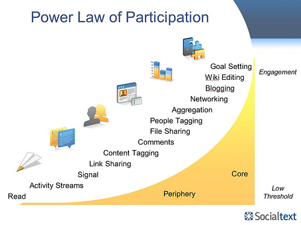

Michael Idinopolus wrote an intriguing post over on [his excellent blog][0] yesterday titled "[Enterprise 2.0: Skip the Pilot.][1]"

I thought I'd repeat some of his arguments because it agrees nicely with an argument I've been formulating lately regarding deployment strategy for social learning software within higher education.

But first to his article:

> There's an orthodoxy in Enterprise 2.0 circles about how you're supposed to run an implementation. The orthodoxy goes something like this: Start with small-scale pilots, define your business objectives, watch the pilots closely, evaluate their success, make a go/no-go decision.
>
> As far as I can tell it's what everyone thinks. In fact, it's what I used to think. Unfortunately, it's dead wrong. The orthodoxy is wrong for a very simple reason: Size matters. By constraining the size of your pilot, you significantly alter the way your company can and will use the tools.
>
> I'm not opposed to pilots for most enterprise IT solutions. Companies like to pilot new technologies with small populations before they roll them out enterprise-wide. That approach makes a lot of sense for transactional systems like order management, project management, purchasing, ERP, and so on. By piloting with a small group, you reduce implementation risk. You get a read on the value of the solution, and you get feedback which you can use to make modifications while those modifications are still relatively easy and inexpensive.
>
> But social software is different from traditional IT. Traditional IT enables individuals to carry out well-defined, highly standardized transactions. Users go into the system to process transactions--to transfer funds, purchase supplies, track inventory, etc. The nature of these transactions, and the system's ability to enable them, do not vary much according to the number of people using the system. Whether 100 people are entering orders or 10,000 people are entering orders, the transactions themselves doesn't really change. What that means is that a representative small-scale sample is an accurate predictor of adoption and value at full scale.
>
> But Enterprise 2.0 tools are different from traditional IT systems. Traditional IT enables **transactions**; Enterprise 2.0 enables **interactions**.
>
> ...
>
> That doesn't mean small-scale Enterprise 2.0 pilots can't succeed. They can, and many do. But even when pilots succeed, they have limited ability to predict how the organization goes on to use the capabilities once they are rolled out enterprise-wide. Pilots typically fall into the lower left-hand corner of the [Social Software Value Matrix][2]: improve existing interactions within existing silos. That includes things like project team workspaces, departmental workspaces, and technical knowledgebases. When organizations really embrace Enterprise 2.0, however, they almost always play in multiple sections of the Value Matrix, launching solutions like collaborative intranets, ideation portals, private extranets, Those solutions, almost by definition, require scale.
>
> Scale is the oxygen that feeds collaboration. That's why collaborative tools like Facebook, and Twitter have taken off so spectacularly on the public web: With over a billion people on the Internet, the opportunities for interpersonal interaction are unbelievably high.

Ok, fair enough. Social software needs other people in order to work properly (imagine Facebook if it was just you there). What does that have to do with deploying a social learning platform at a university?

Before I answer that question, let me step back and explain a bit about what I mean by a social learning platform.

First it's designed to support social learning meaning it's designed to help/encourage/faciliate conversations and connections between like-minded learners as they pursue their personal learning goals.

Second it's a platform giving the software two qualities:

1. It gives people the freedom and tools to build onto the platform -- in the case of a social learning platform, people will primarily build learning communities.
2. [New patterns or structure will emerge within the system][3] that are unplanned and undirected

The social learning platform should improve existing interactions and create new interactions within classrooms, within majors, and between multiple institutions such as nearby universities or members of the community (or in other words, create value in each of the quadrants within the [social software value matrix][2]).

My best stab at creating this tool can be seen at [https://island.byu.edu][4]--a tool I've been building for some time with the help of many others. Island provides simple tools to improve existing interactions and enable new interactions within classrooms, across campus, and eventually will have tools that will allow learners from multiple campuses interact.

So how should such a tool be deployed at a university?

Michael Idinopolus answers that question in a second article "[Launch E2.0 Broad, Then Go Deep][5]" where he references [Ross Mayfield's power law of participation graph][6].

[][5]

The key insight contained in the graph is that for different ways of participating in a social software environment there are different thresholds for joining. Reading takes little skill and effort while editing a wiki takes comparatively considerable more effort and community knowledge.

From this we'd also expect that the higher the threshold to participate in a certain way, the fewer people will participate. Survey results prove that out. While [roughly 20-30% of Americans regularly read blogs][7], only [6% of Americans have created a blog][8] (and probably considerably less regularly write updates).

I've seen the same sort of behavior on Island. I [wrote a post on this subject last year][9] where I noticed a power law that emerged when I graphed the students participation in a number of different ways. I only posted two graphs in that post but the same relationship showed up across all types of participation. A few participated a great deal but most didn't.

Returning to Michael's article:

> Historically, Enterprise 2.0 implementations have focused on collaborative tools [with] fairly high participation thresholds: blogs and wikis. That's not by design, it's by default. Until recently, those were the only Enterprise 2.0 tools that showed potential for high-value business use.
>
> Today, Enterprise 2.0 participation is a whole different game. At the "low threshold" end of the curve, we have low-engagement tools like social messaging (internal "Twitter"), social bookmarking. By leading your implementation with these low-threshold tools, you lower the risk of implementation while still launching at the scale required for success.

He goes on to describe an enthusiastic response to a recent webinar on his companies internal "twitter" app [Signals][10].

> Signals was not just a useful tool, it was also a stepping stone that helped participants move to the right on the Participation curve (see image above). As participants started to get the hang of Signals, many started to ask about Socialtext's other collaborative features: What are workspaces? How do I use the Dashboard? How do I look up an individual?

From what I've seen, most social software deployments in universities have preceded in a similar way to what Michael describes -- deploy high-value learning tools such as blogs and wikis in a small-pilot, evaluate their success, and make a go/no-go decision.

I think this is wrong for the same reasons Michael lists. First, a social learning platform needs large numbers of learners to work ("Scale is the oxygen that feeds collaboration") and second, blogs and wikis are difficult tools to use -- both the steepness of learning curve and the amount of time required to use them effectively. Relatively few students will ever use them to the extent that some of us wish.

In addition, I think we (grizzled web-heads who readily see the value of social software tools such as wikis and blogs in the classroom) frequently underestimate how scary and confusing these tools are to most teachers. These higher-threshold tools -- they don't get in general and definitely don't get in specific, that is, how to use them in their classroom.

With Island we've focused on the bottom of the participation curve -- enabling simple group-based conversations through email. For the past year we've been building and testing Island's infrastructure within the Information Systems major. We're now focused on achieving scale by inviting the rest of the BYU campus. Once we've achieved scale, we'll (to quote Michael again) "deliver deep value by following up with local champions [deans, teachers, students] who want to invest time and effort in more robust, group-specific forms of collaboration."

This, I think, is the correct sequence. Launch simply and broadly. Let students and teachers adjust to having a web-enabled learning environment. Then go deep by building into the social learning platform higher-value tools such as blogs, wikis, and other collaborative learning tools and workflows.

Your thoughts?

[0]: http://michaeli.typepad.com/my_weblog/
[1]: http://michaeli.typepad.com/my_weblog/2009/08/enterprise-20-skip-the-pilot.html
[2]: http://michaeli.typepad.com/my_weblog/2009/04/the-social-software-value-matrix.html
[3]: http://andrewmcafee.org/2006/05/the_mechanisms_of_online_emergence/
[4]: https://island.byu.edu
[5]: http://michaeli.typepad.com/my_weblog/2009/09/launching-at-scale-.html
[6]: http://ross.typepad.com/blog/2006/04/power_law_of_pa.html
[7]: http://www.harrisinteractive.com/harris_poll/index.asp?PID=879
[8]: http://www.pewinternet.org/Commentary/2005/May/New-data-on-blogs-and-blogging.aspx
[9]: /power-law-graphs-from-classroom-community-website
[10]: http://www.socialtext.com/products/signals.php
