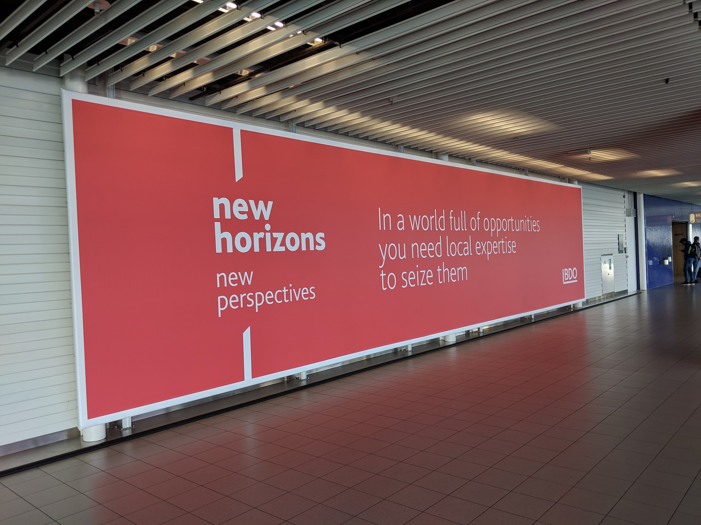
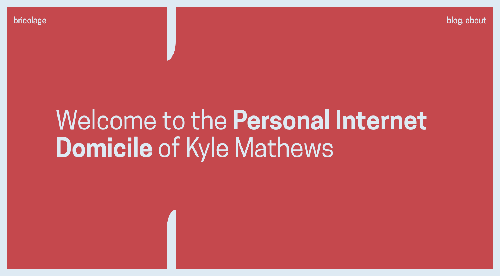

I last redesigned my blog around three years ago — before I started on the rewrite of Gatsby that became Gatsby v1. Which is a long time — and a bummer cause I really enjoy fiddling with my blog design. So #protip — if you want to have time to fiddle with your site's design, don't start large open source projects and startups.

But things are a bit less hectic these days (as much as you can ever say that during a startup) as we've been able to hire some fantastic people at Gatsby inc. — such that I feel much of the load for making things happen is shared across some very capable shoulders.

So here I am playing with my blog again :-) It was only recently that I got the blog upgraded to Gatsby v2 so definitely it's been cobbler-children-ized.

## Typeface

For the redesign, I used one of my all time favorite typefaces, Cooper Hewitt. [Cooper Hewitt](https://www.cooperhewitt.org/) is a design museum in NYC (that I really want to visit some time — design museums tend to be favorites). At some point in the past few years, they did a rebrand and commissioned a custom typeface as part of that. Apparently as a design museum, they feel it appropriate to share as widely as possible all designs they create so they [open sourced the typeface](https://www.cooperhewitt.org/open-source-at-cooper-hewitt/cooper-hewitt-the-typeface-by-chester-jenkins/). Jeremiah Shoaf from [Typewolf](https://www.typewolf.com/) says it's his favorite open source font.

I've been looking for a chance to use it in a project and this felt like the perfect opportunity.

## Homepage

I find airports oddly inspiring design wise. There's a number of them that have very striking designs. In February I spoke at the [Frontend Developer Love conference](https://www.frontenddeveloperlove.com/) in Amsterdam and while walking through the airport after deplaning, this banner ad caught my eye.



I loved the typeface, the red, and especially the angled cut-off vertical lines that framed and directed the eye.

Immediately I wanted this as the inspiration for my new blog design.

After returning home I started fiddling. The first challenge was reproducing the vertical lines as CSS doesn't make that simple. I hit on trying border-radius and after looking at the docs, realized they actually had two potential properties — the second property could make radius elliptical. I played with that until the radius was large enough that the cut-off line was mostly straight.

With a bit of absolute positioning and media queries, I got the the rest of the design working. Then it was just fiddling with the front page copy until it had just the right quirky feel.



## Other notes

### css-in-js still rocks
It's so simple to prototype with and refine styles. My previous design was so old that it pre-dates libraries that add the `css` prop (the full-featured replacement for the classic React `styles` prop). During this redesign I migrated styles to use [Emotion.js](https://emotion.sh/docs/introduction)

It's so fast to prototype and refine code when it's all colocated. Just look at how nice this media query syntax is here:

```jsx
<h1
  css={{
    width: `80%`,
    color: whitish,
    fontWeight: 600,
    fontSize: scale(5 / 5).fontSize,
    lineHeight: 1.1,
    "@media (min-width: 420px)": {
      fontSize: scale(7 / 5).fontSize,
    },
    "@media (min-width: 768px)": {
      fontSize: scale(10 / 5).fontSize,
    },
  }}
>
  <span css={{ fontWeight: 400 }}>Welcome to the</span> Personal
  Internet Domicile{` `}
  <span css={{ fontWeight: 400 }}>of Kyle Mathews</span>
</h1>
```

### Typography.js

[Typography.js](https://github.com/KyleAMathews/typography.js/) is my attempt at making a lib to generate typography CSS from a few base options.

E.g. the options for this site look like this:

```js
let theme = {
  baseFontSize: `18px`,
  headerFontFamily: [`Cooper Hewitt`, `sans-serif`],
  bodyFontFamily: [`Cooper Hewitt`, `sans-serif`],
  plugins: [new CodePlugin()],
  baseLineHeight: 1.45,
  blockMarginBottom: 0.85,
}
```

I really love how elegant it is — 100s of lines of CSS are generated from
less than 10 lines of code. CSS is a really low-level primative for many tasks.

### Gatsby
It almost goes without saying that the site is built with [Gatsby](https://www.gatsbyjs.org/) :-D But just in case, I'll mention it. Gatsby is sweet and you should use it too.
