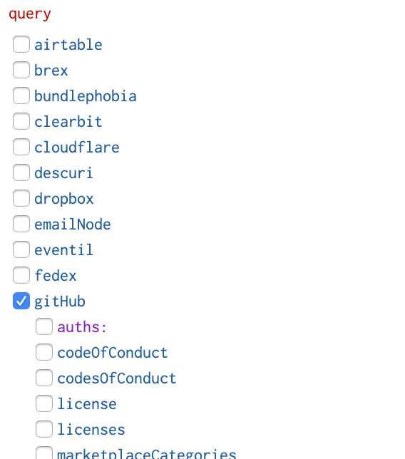
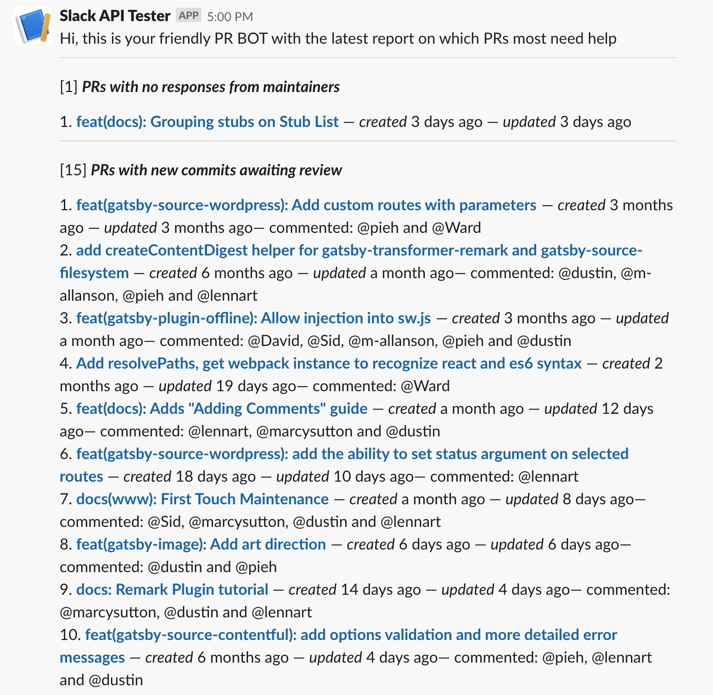
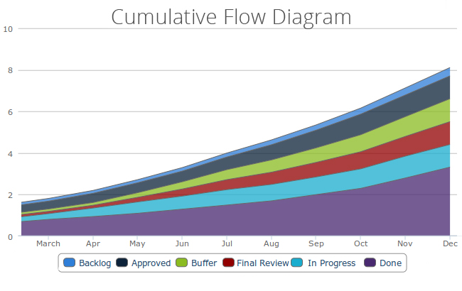

Gatsby gets a lot of PRs. We’ve been averaging ~100 / week for the past few months. And even with the great OSS team we’ve built, this is a lot of code changes to keep on top of.

For most of Gatsby’s history, we’ve been able to rely on GitHub’s built-in notification and sorting tools to track PRs and make sure we’re giving adequate attention to different proposals that are coming in. But it’s felt the last few months like we’re reaching the limits of these tools. We’ll sometimes miss PRs in the flood of notifications and everyone feels stretched.

Scaling projects often introduce novel problems. And novel problems can only mean one thing! Time for some theory!!

My all-time favorite product theory book is [_The Principles of Product Development Flow_](<https://www.amazon.com/dp/B007TKU0O0/ref=dp-kindle-redirect?_encoding=UTF8&btkr=1>) which has unparalleled depth of analysis around what really makes product development tick.

I highly recommend anyone deeply involved with product to read it. The book is about 10x deeper than the normal handwavey product advice you hear and ever so worth the time investment to wrap your head around its ideas.

On a recent plane ride, I skimmed through the book looking for ideas to help us get a better handle on all the PRs we get.

## The Economic Basis of Product Development

Chapter 2 jumps into what the author considers the most important subject of the book — how to determine the economic value of any work you might be doing. If you can’t determine that, than any other measures you might take to guide product development are on shaky foundations.

>As obvious as this may seem, this economic view of product development is surprisingly uncommon. Instead, product developers create a large number of proxy objectives: increase innovation, improve quality, conform to plan, shorten development cycles, eliminate waste, etc. Unfortunately, they rarely understand how these proxy objectives quantitatively influence profits. Without this quantitative mapping, they cannot evaluate decisions that affect multiple interacting objectives.

He dislikes proxies :-)

We should measure what we actually care about — does some work contribute to the company’s mission and bottom line (directly or [indirectly](<https://www.amazon.com/dp/B004H4XD40/ref=dp-kindle-redirect?_encoding=UTF8&btkr=1>)).

Clearly for Gatsby, we think PRs and the people writing the PRs are valuable — in the sense that our mission is to directly help build people and communities and to create tools that empower people and organizations. We want contributors because participating in Open Source directly helps their career and their contributions directly improves Gatsby which benefits everyone using it and the better Gatsby becomes, the more viable our commerical products & services become — which viability is what sustains and drives the whole process.

## Managing queues

The next chapter is on “Managing Queues”. Really fun stuff.

>In the last chapter, I showed you how to use an economic framework to guide your product development decisions. When we use such a framework, we often discover that cycle time has high economic leverage. If we can find cheap ways to reduce cycle time, our profits go up. But what causes long product development cycle time?

He dives into the theory of queues and how to manage queues — particularly when they get too long. Which theory was largely invented by a mathematician named Agner Karup Erlang (where have I heard that name before…🤔) at the Copehhangen Telephone Company who in 1909 was trying to determine how many phone lines were needed for a specific number of people.

The main principle from there we’ve taken to heart at Gatsby is principle 4: “**The Principle of High-Queue States: Most of the damage done by a queue is caused by high-queue states.**"

“High-queue states” means in our context — too many PRs. PR count naturally flucuates as PRs come in semi-randomly and core maintainers have time to review and merge them. Sometimes these natural fluctuations mean the PR count soars to unusually high numbers. If not taken care of rapidly, this means the whole process of reviews will get bogged down.

The current rule we’ve adopted is that 115 PRs is a warning state when more people should shift over to working on PRs and 130 is red state when everyone should stop what they’re doing to focus on PRs.

This has been very successful as in the past, we’d at times get into 140+ PR count range and it’d kinda sit there for a few days until someone would finally heroically drive it down. Now PRs tend toward a 100-115 count and we rarely move past that for long.

## Multiple classes of queues?

But it didn’t still feel like we were measuring things correctly. We’ve been inconsistent at responding to PRs and sometimes valuable PRs have slipped through the cracks and sat untouched for months. E.g. at the recent Drupalcon, an engineer came up to me after my talk and mentioned he’d opened a PR that hadn’t gotten merged. I looked and it was a great PR and luckily [Dustin Schau](<https://twitter.com/SchauDustin>) (also at the conferece) was able to review and merge it immediately. Luckily the developer was still in the middle of his Gatsby/Drupal project and hadn’t had to go into production with this bug unfixed.

It’s really bad when fixes like this don’t get reviewed and merged promptly. Not only is the contributor still having to work around the bug but unknown number of other users are also facing the same bug (and perhaps not able to work around it—meaning they might abandon Gatsby altogether). But even worse, if we fail to help the contributor quickly, they might end up feeling a bit snubbed and that we don’t want them contributing. We never know which casual first contribution, treated really well, is going to turn into a repeat contributor who invests deeply in the project and makes it their own.

So with this in mind, I was reading chapter 6 on applying WIP constraints and ran across this principle:

>The Principle of the Critical Queue: Constrain WIP in the section of the system where the queue is most expensive.

It occurred to me that PRs weren’t actually _one_ queue but many. And that the different queues had different costs. A PR that has been opened and not reviewed is very different than a PR that was reviewed and is now awaiting contributor feedback.

The first PR might be from a new contributor who needs to be made felt welcome and appreciated. The first PR might have a fix for a critical bug that’s affecting a lot of people. _Not_ reviewing the first PR is very expensive.

The second PR, on the other hand, can sit for a bit while the contributor comes across more free time to respond to suggestions.

## Applying WIP constraints to PR queues

The trick now was how to identify the different queues and apply WIP constraints. When you think of PRs as hemogenous, then the normal GitHub PR view is great — you can view new PRs, the oldest PRs, etc. But when you want to split PRs up into different queues, lumping PRs into a single queue becomes a problem. The mass of PRs awaiting review are getting in the way of finding the few PRs that haven’t been reviewed!

So time for some custom code.

I didn’t want to create a new “view” of the different PR queues, but I wanted to apply WIP constraints — prevent the high cost queues from growing too large. And the easiest way to do that it seemed was to create a Slack bot that’d tell us when there were unreviewed PRs.

## OneGraph

Enter [OneGraph](<https://www.onegraph.com/>) — whose tagline sums things up nicely: “We handle the messy integration work.  You focus on the interesting problems.”

Their mission resonates deeply with me as Gatsby is focused on a similar problem (in part) — how to get data out of APIs into websites without “messy integration work”.

Anyone who’s worked with APIs know they’re often a riot (the bad sort, not e.g. a riot of color) of poorly documented & inconsistent APIs locked behind authentication systems that seem just as determined to keep you out of your data as the bad actors. This isn’t a GraphQL vs. REST article but it’s hard not to mention that the excessively freeform nature of REST APIs pretty much guerentees this 😜 (This is not a knock against all the hard-working API teams out there — it’s just API design is a _hard_ problem and the lack of built-in constraints in most APIs doesn’t help).

Anyways, OneGraph does a great job of fixing that by wrapping all the messiness of integrating with APIs into a consistent GraphQL based UI. Just look how beautiful this view from their dashboard is:

Just click on a provider, authenticate via oauth, and you’re off. That’s easily 100x faster than normal.

So back to the Slack bot. With OneGraph, I quickly found the data that I needed from GitHub. OneGraph has a very nice "Code Exporter" that gives you starter code to run your queries from browser code or in node.js. I used that to pull the data into a node script where I could split PRs into the different queues.

For generating the Slack messages, Slack [has created a nice tool](https://api.slack.com/tools/block-kit-builder) for designing how messages will look. I went back and forth between tweaking output in Slack’s design tool and applying those tweaks to the script until I had something I liked.

## Running the script once a day

Now to a classic programming problem — how to run your code every so often? The classic solution is [cron](https://en.wikipedia.org/wiki/Cron). But I didn’t want to create a VM running linux to run a little node script once a day. I’m a big fan of serverless and was curious which would be easiest to use for this.

I [tweeted out a question](<https://twitter.com/kylemathews/status/1119735659139223552>) and soon had more than enough solutions to try.

The one response that intrigued me the most was [render.com](<https://render.com/>) as someone literally tweeted a screenshot of a button in their web app that said “New Cron Job”.

That seems on point.

Also, (perhaps not coincidentally!), their site is built on Gatsby.

And sure enough, five minutes later, after connecting the GitHub repo for the project and instructing it how to build and run the code, the Slack bot was set to run daily.

## Early Results

With this we discovered we had six PRs that hadn’t had any reviews — several that were close to a month old. Those got reviewed quickly (the last one in the screenshot above is waiting a core member’s review who’s on holidays until tomorrow).

We’ve eaten into the other queue as well and expect to bring it down quickly as well.

As a new tool, we’ll be iterating rapidly on the tool design as we discover what helps.

## Next steps

- **Let maintainers generate the report on demand in addition to sending it once a day** — sometimes it’s nice to see evidence your hard work is making an impact + if another maintainer has already been working on reviewing PRs, a fresh list is necessary to know where to dive in at.
- **Create a public dashboard**. We only use Slack for those of us who work at Gasby Inc. A public dashboard with the same info is necessary to let everyone help out with high value PRs + it provides public accountability for how well we’re doing.
- **Alert more frequently on really high value queues** — e.g. PRs that have been reviewed and accepted and whose tests are now passing. Those just need a click of the merge button and publish for the fix or improvement to out in the wild.
- **Add [Cumulative Flow Diagrams (CFD)](<https://kanbantool.com/cumulative-flow-diagram>)**. Very useful tool (the book says its the most useful tool for managing queues) to visualize in and out going PRs. It’d be great to add one for the different PR queues. 
- **Do similar work for issues!** We really care about ensuring issues get responded to promptly as well as PRs. We started this work on PRs but want to apply queueing and WIP constraint theory on them as well.

## Conclusions

- Product development theories are very handy for solving real-world problems.
- OneGraph & render.com & Slack bots are a great combo for quickly creating custom OSS maintenance tools.
