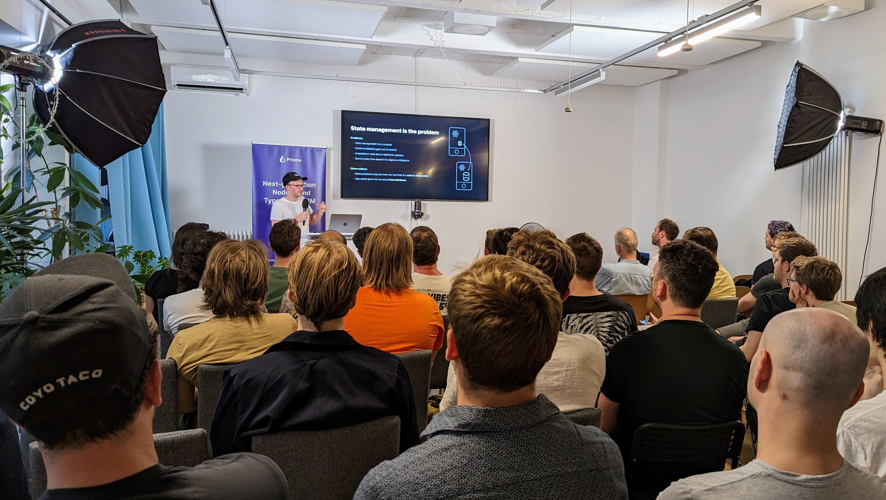

A few months ago in June, I attended [a local-first meetup in Berlin](https://www.youtube.com/results?search_query=Local-First+Meetup+Berlin+%231) organized by Johannes Schickling, formerly the founder of Prisma. An intellectual crackle filled the air as we watched demos of new libraries and products. Many of us had been independently playing around with local-first development ideas for a while — in my case, over a decade — and the in-person meetup gave us the chance to trade notes late into the night.



In the months since, I’ve continued to tinker with these technologies and collected some point-in-time notes on significant developments and what might happen in the years to come.

### Table of Contents

```toc
# This code block gets replaced with the TOC
exclude: Table of Contents
```

## What’s Happening?

The web feels ready for a major upgrade. We had tightly coupled web frameworks in the Rails/Django years and lost them with the shift to API-powered SPAs. The developing database-grade sync technology will tightly recouple our application stacks allowing for a new era of framework innovation.

I see “local-first” as shifting reads and writes to an embedded database in each client via“sync engines” that facilitate data exchange between clients and servers. Applications like Figma and Linear pioneered this approach, but it’s becoming increasingly easy to do. The benefits are multiple:

- Simplified state management for developers
- Built-in support for real-time sync, offline usage, and multiplayer collaborative features
- Faster (60 FPS) CRUD
- More robust applications for end-users

(Some good reading material: this local-first case study on [building reactive, data-centric apps](https://riffle.systems/essays/prelude/) and [Johannes’ talk in Berlin](https://www.youtube.com/watch?v=jxuXGeMJsBU&t=1s); I will include some more links later.)

Like the shift to componentized JavaScript UI over the last decade, I believe local-first will be the next large paradigm shift for rich client apps and work its way through the application world over the next decade

## Why is Local-First Happening Now?

I’ve read about and played with local-first type ideas for a decade or so but only now does it seem to be gaining steam with many young startups rushing to productize its ideas.

Figma, Superhuman, and Linear are good examples of pioneering startups in the local-first paradigm and all rely on local-first ideas and bespoke sync engines to support their speed and multiplayer UX.

Many builders now see local-first as a key way to differentiate their applications.

Why is this happening now?

My general model for change in technology is that a given community of practice (like application developers) can only adopt one large paradigm shift at a time. While local-first ideas have been floating around for decades, practitioners have so far been focused on more fundamental changes.

What we’ve seen over the last decade is that application speed and collaboration features are powerful vectors to shake up an incumbent industry. Figma used local-first to displace Sketch and InVision; Linear is using local-first to displace Jira.

We’ve shifted from Rails-type server-rendered apps, to single-page-apps powered by APIs. A core lesson from this transition is that while standard REST and GraphQL APIs are very easy to get started with for solving client/server sync, they require significant effort and skill to scale and refine and they struggle with use-cases like multiplayer and offline support.

Sync engines are a robust database-grade syncing technology to ensure that data is consistent and up-to-date. It’s an ecosystem-wide refactor that many talented groups are exploring to attempt to simplify the application stack.

Assuming they succeed, they'll provide a solid substrate for new types of framework that can rely on local data and rock solid sync.

## Will Most Rich Client Apps Use Local-First?

I’ve chatted with a number of developers who — frustrated at maintaining the homegrown bespoke sync systems they wrote — are replacing it with new local-first tooling. The tooling feels a lot better and having standard primitives make it easier to build great experiences.

Local-first is developing into an ecosystem similar to authentication services but for handling data and features that need to be real-time, collaborative, or offline.

The key question for us technologists is whether local-first will remain a niche technology or if it’ll gradually replace the current API-based approach.

It’s still early but I’m confident that at a minimum, we’ll see multiple breakout startups along with a few healthy open-source ecosystems around the different approaches. And if local-first becomes the new default paradigm for handling data, it will be much larger and reshape many parts of the cloud ecosystem.

But: there are many issues to solve first! Let’s look in detail at one of the first issues that people encounter: handling CRUD operations.

### CRUD with CRDT-based Sync Engines

To fully replace client-server APIs, sync engines need robust support for fine-grained access control and complex write validation.

The most basic use case for an API is _state transfer_ from the server to the client. The client wants to show information about an object so reads the necessary data through the API.

Local-first tools all handle this perfectly. They ensure the latest object data is synced correctly to the client db for querying from the UI.

But while reads are generally easy, support for complex writes is still immature in local-first tooling. Clients tend to have unrestricted write access and updates are immediately synced to other clients. While this is generally fine for text collaboration or multiplayer drawing, this wouldn’t work for a typical ecommerce or SaaS application.

Local-first tools need somewhere to put arbitrary business logic written in code, because real-world systems start out elegant and simple and, over time, accumulate lots of messy, important chunks of logic.

A data property might normally be limited to 20 but Acme Corp paid $50k to get a limit of 100. Or write access needs to be restricted for sensitive information like account balances. Or writes need validation by third party APIs, like a calendar booking system that needs to ask an external calendar API if a time slot is open.

Normally, these inevitable chunks of code and logic live on the server behind an API. And we still need somewhere to put them in a local-first world.

Put differently: local-first CRDT-based sync engines can drive consistency within a system but real-world systems also need an authoritative server which can enforce consistency within external constraints and systems.

Or as Aaron Boodman, a [Replicache](https://replicache.dev/) co-founder, put it: “CRDTs converge, but to where?”

### Using a Distributed State Machine to Handle Complex Writes

I asked Anselm Eickhoff and James Arthur (founders of [Jazz](https://jazz.tools/) and [ElectricSQL](https://electric-sql.com/) respectively, both CRDT-based tools) about how they suggest handling writes that need an authoritative server.

They both suggested emulating API request/response patterns through a distributed state machine running on a replicated object.

So let’s say a client wants to update the user name. It creates the following object:

```json
{
  "machine": "updateUserName",
  "state": "requestedUpdate",
  "request": {
    "name": "Fred",
    "id": 123,
    "timestamp": 1694122496
  },
  "response": {}
}

// User 123
{
  "name": "Bob",
  "id": 123
}
```

The server listens for writes and upon receiving this one, validates the request and updates the state machine object along with the name on the user object (which again are synced back to clients as the "server" is just another client):

```json
{
  "machine": "updateUserName",
  "state": "finished",
  "request": {
    "name": "Fred",
    "id": 123,
    "timestamp": 1694122496
  }
  "response": {
    "error": false,
    "timestamp": 1694122996
  }
}

// User 123
{
  "name": "Fred",
  "id": 123
}
```

This has the interesting and useful implication that in-flight requests are synced to other clients and it’s trivial for the server to emit progress updates. E.g. an app that supports a team of users uploading images for some nifty AI enhancements. The client can emit progress updates on the upload and the server as it works through enhancements.

In other words, requests/responses have the same multiplayer, offline, real-time sync properties as the rest of the app.

This pattern can be wrapped up in a standard mutation function e.g. `const {res, error} = await updateName({ name: "fred" })`

Jazz also lets you restrict writes to certain object fields to a specific role. Sensitive information would be marked read-only for clients who would need to request the server to update them.

### Local-First DX is Still Being Explored

Beyond the question of _can_ you build any application with local-first tools, there’s still the question of whether devs will _want_ to.

- Do advantages make it worth learning a new stack and migrating applications?
- There’s a lot of missing components still — what will a full production DX for a local-first toolchain look like?
- How complex will it feel to build a simple app?
- Is there enough demand to fund all the new libraries and products that’ll need to be built?

The success of Figma, Superhuman, and Linear suggest these issues will get solved in time.

## What Approaches are People Exploring Now?

I’m grouping approaches I see into three broad categories.

### 1. Replicated Data Structures

These projects provide support for replicated data structures. They are convenient building blocks for any sort of real-time or multiplayer project. They typically give you APIs similar to native JavaScript maps and arrays but which guarantee state updates are replicated to other clients and to the server.

It feels like magic when you can build a simple application and and see changes instantly replicate between devices with no additional work.

Most replicated data structures rely on CRDT algorithms to merge concurrent and offline edits from multiple clients.

There’s a number of open source and hosted projects offering replicated data structures, including the granddaddy in this space, Firebase, plus many newer ones.

These services are great for making parts of an app real-time / multiplayer. E.g. a drawing surface, a chat room, a notification system, presence, etc. They’re very simple to get started with and the shared data structures approach offers a much better DX than manually passing events through with websockets or push messaging services.

Open source projects:

- [Yjs](https://yjs.dev/)
- [Automerge](https://automerge.org/)
- [Jazz](https://jazz.tools/)
- [Evolu](https://www.evolu.dev/)

Hosted services:

- [Firebase](https://firebase.google.com/)
- [Liveblocks](https://liveblocks.io/)
- [Partykit](https://www.partykit.io/)
- [Triplit](https://www.triplit.dev/)
- [Reflect](https://reflect.net/)
- [Instant](https://www.instantdb.com/)
- [Ditto](https://www.ditto.live/)
- [Dexie Cloud](https://dexie.org/cloud/)

### 2. Replicated Database Tables

An approach several projects are taking is to sync from Postgres to a client db (generally SQLite). You pick tables (or materialized views) to sync to the client and then they get loaded along with real-time updates as writes land in Postgres.

SQLite in the browser is one big advantage of this approach as it gives you the rich, familiar querying power of SQL in the client.

Given Postgres’ widespread usage and central position in most application architectures, this is a great way to start with local-first. Instead of syncing data in and out of replicated data structures, you can read and write directly to Postgres as normal, confident that clients will be in sync.

I’ve built a number of job queues and notification systems over the years and they’ve all struggled with their version of the Byzantine Generals problem. Clients would miss an update (usually due to being offline), and then users would complain about zombie jobs that never finished. In contrast, replicated database tables mean the background process can simply write updates to Postgres, confident all connected clients will get the update.

#### Postgres to SQLite:

- [ElectricSQL](https://electric-sql.com/)
- [Powersync](https://www.powersync.co/)
- [SQLedge](https://github.com/zknill/sqledge)

ElectricSQL and Powersync support syncing client writes back to Postgres and other clients.

#### Some Related Database Syncing Tools:

- SQLite to SQLite

  - [libSQL](https://libsql.org/)
  - [SQLSync](https://github.com/orbitinghail/sqlsync)
  - [VLCN](https://vlcn.io/)
  - [Mycelite](https://mycelial.com/)

- MongoDB to Client DB
  - [Realm](https://realm.io/)

### 3. Replication as a Protocol

The startup [Replicache](https://replicache.dev/) has a unique “replication as a protocol” approach. Replicache is a client JS library along with a replication protocol — which lets you integrate arbitrary backends, provided you follow the spec. It’s more upfront work, as the sync engine is “some assembly required”, but as Replicache is mostly your own code, it gives the most flexibility and power of any local-first tool I’ve seen to date. The startup behind Replicache is also building Reflect, a hosted backend for Replicache.

## So…Should You Go Local-First?

I think it depends on your use case and risk tolerance.

For the right people and teams, it’s an exciting time to jump in. Realtime, multiplayer, and offline features will significantly improve much of our day-to-day software.

For almost any **real-time use case**, I’d choose _replicated data structures_ over raw web sockets as they give you a much simpler DX and robust guarantees that clients will get updates.

For **multiplayer and offline**, again you’ll almost certainly want to pick an open source _replicated data structure_ or hosted service. There’s a lot of difficult problems that they help solve.

The _Replicated Database_ approach also works for the real-time, multiplayer, offline use cases. It should be especially useful for data-heavy applications and ones with many background processing writing into Postgres.

But in general, I’d still be wary of using local-first outside real-time / multiplayer / offline use cases. Local-first is definitely still bleeding-edge. You will hit unexpected problems. A good community has rapidly developed, but there’ll still be some stretches on the road where you’ll have to solve novel problems.

So: if you need local-first, see if it makes sense to isolate the local-first parts and architect the rest of the app (for now) in a more conventional fashion.

I’ve found that most of the major tools have plenty of examples and demos to play with and active Discord channels. There’s also a general local-first community over at https://localfirstweb.dev/ and they hold regular meetups.

Following along, I'm getting a lot of the same vibes that I got in the then-nascent React community circa 2014 or 2015.

There are also a lot of interesting implications of local-first development in the realm of privacy, decentralization, data control and so on, but I’ll leave it to others more well-versed in these topics to flesh them out.

And some more links below. Happy building!

- [https://www.inkandswitch.com/local-first/](https://www.inkandswitch.com/local-first/)
- [https://tantaman.com/2022-08-23-why-sqlite-why-now.html](https://tantaman.com/2022-08-23-why-sqlite-why-now.html)
- [https://tonsky.me/blog/the-web-after-tomorrow/](https://tonsky.me/blog/the-web-after-tomorrow/)
- [https://www.youtube.com/watch?v=aJh2VVEDWw4](https://www.youtube.com/watch?v=aJh2VVEDWw4)
- [https://www.powersync.co/blog/sqlite-persistence-on-the-web](https://www.powersync.co/blog/sqlite-persistence-on-the-web)
- [https://www.youtube.com/watch?v=Wo2m3jaJixU](https://www.youtube.com/watch?v=Wo2m3jaJixU)
- [https://www.wired.com/story/the-cloud-is-a-prison-can-the-local-first-software-movement-set-us-free/](https://www.wired.com/story/the-cloud-is-a-prison-can-the-local-first-software-movement-set-us-free/)
- [https://stopa.io/post/296](https://stopa.io/post/296)
- [https://www.figma.com/blog/how-figmas-multiplayer-technology-works/](https://www.figma.com/blog/how-figmas-multiplayer-technology-works/)
- [https://electric-sql.com/blog/2023/02/09/developing-local-first-software](https://electric-sql.com/blog/2023/02/09/developing-local-first-software)
- [https://electric-sql.com/blog/2022/12/16/evolution-state-transfer](https://electric-sql.com/blog/2022/12/16/evolution-state-transfer)
- [https://electric-sql.com/docs/reference/alternatives](https://electric-sql.com/docs/reference/alternatives)
- [Linear's CTO's thread on DX advantages of Local-First](https://twitter.com/artman/status/1558081796914483201)
- [Building an offline realtime sync engine](https://gist.github.com/pesterhazy/3e039677f2e314cb77ffe3497ebca07b)
- [Twitter thread with local-first use cases](https://twitter.com/samwillis/status/1694328387601362966)

Discuss this post on [X.com née Twitter](), [Farcaster](https://warpcast.com/kam/0x0c1632), or [Bluesky](https://bsky.app/profile/kam.bsky.social/post/3k77qihvoip2h)

_Thanks to Sam Bhagwat, Shannon Soper, Johannes Schickling, Andreas Klinger, Pekka Enberg, Anselm Eickhoff, and James Arthur for reading drafts of this post_
