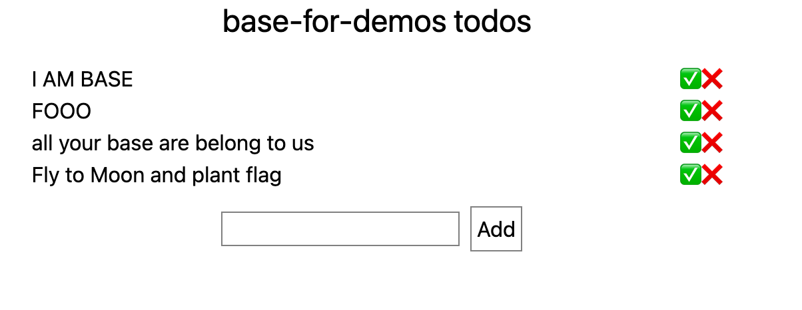
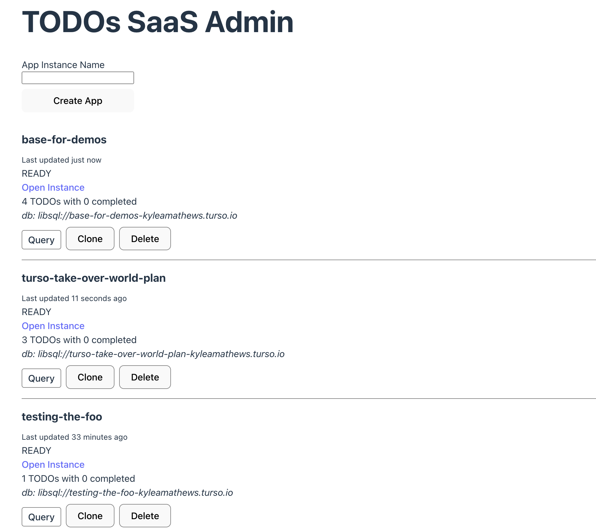

[Turso](https://turso.tech/) is a SQLite-in-the-cloud startup with automatic backup and multi-region leader-follower replication across dozens of regions.

Last week they [announced that you can now have up to 10,000 databases](https://blog.turso.tech/turso-radically-increases-the-amount-of-databases-available-on-their-starter-and-scaler-plans-10a69ad94055)! A huge jump over their previous limit of 6.

This new capability lets us do something interesting — build a SaaS app where instead of one shared database, each user or customer gets their own database. Why?

Two reasons:

* Data isolation
* Compliance and data sovereignty

To quote their launch blog post:

>If you have sensitive customer data that you need to keep isolated, a database per customer is the best solution. With this architecture, you won’t need to build any complex permission logic on the backend. Also, exporting data, should your customer request, is trivial: just give them a copy of the entire database!
>
>Turso is great for replicating your data across the world. But not all data needs to be replicated everywhere. In fact, some data cannot legally be replicated outside its jurisdiction.
>
>Want to keep data replicated where it matters most, but still take advantage of great edge-based replication? Spin a database for each user, and replicate it only in the locations where you need it.

I’ve been advising them for a while and worked with them to build a small TODOs demo SaaS product to explore closer how this would work.

I built "TODOs" — a SaaS app that lets anyone create their own TODO list. You can play around with a live instance at [https://admin-todos-saas.fly.dev/](https://admin-todos-saas.fly.dev/) & browse the code at [https://github.com/KyleAMathews/multi-tenancy-saas-demo](https://github.com/KyleAMathews/multi-tenancy-saas-demo)

## A Sample TODOs list

Then for admins, there’s an Admin app that shows at a glance critical information about each TODO list instance e.g. when it was last active, the number of TODOs, and its Turso DB url. It also lets admins take quick actions like creating and deleting list instances.

Two other interesting features.

* You can run queries directly from the Admin db directly against each instances’ db. Great for quickly introspecting on live data.
* Every TODO list can be cloned. This is great for debugging e.g. capturing a broken instance for further debugging locally as well as creating demo instances for showing potential customers. This leverages Turso’s new database branching feature. Because all data for an instance is in a single database, cloning an instance is literally one API call to Turso.

The tech stack is:

* Turso for admin & instance databases (obviously)
* Remix for the admin & TODO apps
* Fly.io for hosting

There’s an admin db that stores all the information about instances. The Remix app server uses an embedded replica of this db ([another new feature!](https://blog.turso.tech/introducing-embedded-replicas-deploy-turso-anywhere-2085aa0dc242)) to get db credentials, etc. for each instance.

## Reflections

SQLite is really delightful to use — it just feels very light to develop against it. Both that it’s very fast of course but also, that there’s just not much to think about. No Docker instance to babysit for the DB. Just import a library and a few SQL commands.

Turso extends that feel to the cloud. To move your local dev SQLite setup to a cloud-hosted database, you just add a Turso db URL & authToken and you’re done.

SQLite has always been great but never felt quite production-ready without some extra leg work like moving the db file to each process, backups, and multi-region replication. Turso has now done that legwork for you.

It’s been remarkable watching the emergence of cloud database hosting during my career. Outside of tightly integrated frameworks like Rails, etc. databases were a lot of work to setup and operate. Now they’re (almost) trivial to setup and start running.

I love all the energy in developer tools because they’re enabling more and better software to be built. The world increasingly runs on software and it’s to everyone’s benefit if that software continues to get better and better.

Turso opens a lot of new design space for architectures and I'm excited to see what people build with it in the coming years. If you’re prototyping a new feature or app and you’ve looked at SQLite or are interested in edge dbs and data locality, you should give Turso a try.
