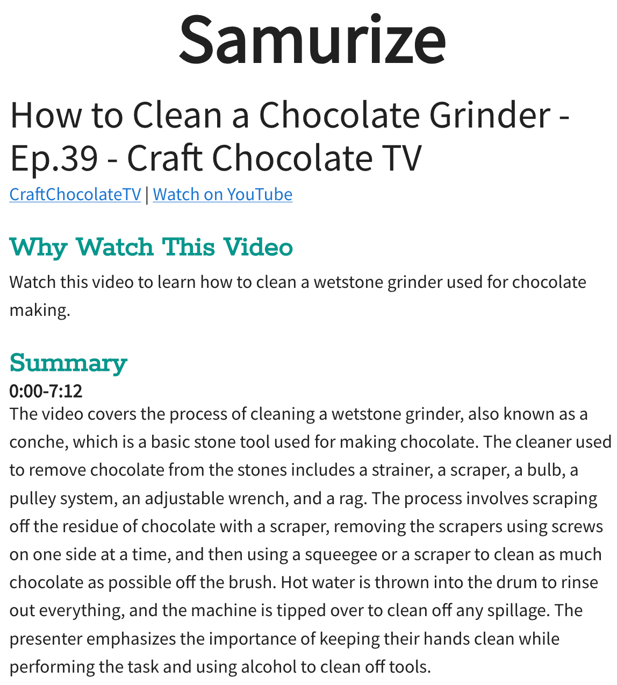

My wife and I have been working on a side project for a while — an AI-powered tool that summarizes YouTube videos.

This tool was highly inspired by [https://www.summarize.tech/](https://www.summarize.tech/) — which I used a lot before building my own — so thanks NAME

There’s a lot of videos you might want to read a quick summary as either that’s the extent of your interest or to see if the video is interesting. Skimming through a video is hard while skimming a video summary is fast



We were also looking for a fun side project while my wife did her job hunt and partly as an excuse to build something with LLMs and Local-First tools (ElectricSQL in this case). If you’re new to [Local-First — check out my explainer post from a few months ago](https://bricolage.io/some-notes-on-local-first-development/).

Check it out at [https://samurize.shannonsoper.com](https://samurize.shannonsoper.com) and then read on for some build notes.

### Table of Contents

```toc
# This code block gets replaced with the TOC
exclude: Table of Contents
```


## Lazy syncing and pre-caching route queries for fast & smooth route transitions

ElectricSQL syncs data between a backend Postgres database and client SQLite database. Instead of loading route data from a backend API, you just run SQL queries against the local data! 

Which is awesome! I love having the full power of SQL to query data + built-in reactivity for real-time updates. It’s really everything I’ve ever wanted for client-side data.

But there’s two issues before your reactive query can go to work. First is ensuring the data you want to query is synced. And the second is pre-running the query so the new route can immediately render.


### Route Syncing

The simplest way to build a local-first app is to just sync upfront all data but this gets slow as the data size grows. So just like with code splitting, you can split data syncing along route boundaries so the user waits for only the minimal amount of data to be synced.

It’d be really rare to want an entire database synced to each client. So instead you can specify which tables and even which subsets of tables — e.g. only load the latest 10 notifications.

ElectricSQL has this concept of “[Shapes](https://electric-sql.com/docs/usage/data-access/shapes)” — which let you declare the shape of data you want synced. It’s basically the declarative equivalent of making an API call (an imperative operation). Instead of saying “fetch this data”, you say “sync this data”. You get the same initial load and ElectricSQL also ensures any updates continue to get synced to you.

This is basically jQuery -> React again — jQuery made you push the DOM around and add event listeners, etc. — work we don’t have to do with React and other new reactive JS frameworks. And in the same sense, sync engines like ElectricSQL give you a real-time reactive data system for your entire stack. Your client can declare the data it needs and ElectricSQL makes it so.

So shapes are great but the next question is where to put them. The route loader function (in React Router) seems to me the obvious place and what I did with Samurize.

There’s a few moving parts here. First what is the shape, second what state is syncing of that shape in (never synced, synced and up to date, or synced but stale (and how long ago was the last sync).

I proposed an API for this to ElectricSQL at [https://github.com/electric-sql/electric/discussions/704](https://github.com/electric-sql/electric/discussions/704) that looks like


```ts
{
  path: `/video/:videoId`,
  element: <Video />,
  loader: async ({ params }) => {
    await syncManager.load([
      {
        shape: () =>
          db.users.sync({
            where: { id: params.user_id },
          }),
        isDone: (shapeMetatdata) =>
          shapeMetadata.msSinceLastSynced < 12 * 60 * 60 * 1000 ||
          shapeMetadata.state === `SYNCED`,
      },
      {
        shape: () =>
          db.youtube_videos.sync({
            where: { id: params.video_id },
          }),
        isDone: (shapeMetatdata) =>
          shapeMetadata.msSinceLastSynced < 12 * 60 * 60 * 1000 ||
          shapeMetadata.state === `SYNCED`,
      },
    ])
    return null
  },
}
```


As these are all functions, you could reuse common shapes across routes e.g. user and org data. You can also flexibly say what “done” is—e.g. for some routes, somewhat stale data is fine, so don’t wait on loading for the freshest data to be loaded from the server.


### Pre-running queries

The other problem I ran into is that while local SQLite queries run very fast, they are async and take a bit of time, so on transitioning to a route, there’s some number of frames where nothing renders. So while fast, it causes a very noticeable blink in the UI.

Make the above clearer and show how it’s similar to react-query

I fixed that by running each routes’ queries in the loader function, storing those in a cache, and then using the pre-run query results until the live queries start running.

The difference is stark:

### Glitchy transition

<video controls width="500">
  <source src="./glitchy-route-transition.mp4" type="video/mp4" />
</video>

### Smooth transition

<video controls width="500">
  <source src="./smooth-route-transition.mp4" type="video/mp4" />
</video>


It wasn’t much code but I think it’s a critical pattern to follow so I’ll be pulling it out into its own library very soon.

This is similar to how people use tools like [TanStack Query](https://tanstack.com/query/latest) — where they prefetch in the loader to warm the cache so the query hook in the route component can respond immediately.


## LLM/AI stuff

The AI bits are pretty standard so I won’t spend a lot of time on them.

When a new video is submitted, it’s pushed to a node.js backend which fetches video metadata including the transcript. The transcript is then summarized using the map/reduce technique. Basically I split longer videos into five minute segments, summarize each segment and then summarize together the segments. This handles transcripts that are longer than token limits but also conveniently gives the user both an overall summary plus more detailed summaries about each segment of the video. Often I’ll only read the overall summary but sometimes I want to learn more so open the more detailed summaries.

I started prototyping this with OpenAI’s GPT 3.5 model but got frustrated as response times were highly variable. Sometimes I’d wait as long as 45-60 seconds for a summarization to finish. With that speed, I might as well just skim through the video! So I went looking for other options and found [Perplexity.ai’s new LLM API](https://blog.perplexity.ai/blog/introducing-pplx-api) which hosts a number of open source models. I tested them all and Mistral 7B was very fast (5-10 seconds!) & acceptably good at summarization so switched over.

Even basic LLMs are already good enough at many tasks so I think many workloads will keep shifting to whatever is fastest/cheapest.

## Real-timey bits

This was a pretty stock standard app. The only thing I did which really took advantage of ElectricSQL superpowers was the progress bar for indicating progress of the summarization.

<video controls width="500">
  <source src="./progress-bar.mp4" type="video/mp4" />
</video>

As ElectricSQL gives you a full-stack reactive data layer for free — it was quite easy. A progress bar is just a value between 0 & 1, i.e., what percentage of the work has been done. The question for this sort of long-running job is how to get that value from the backend doing the work to the frontend for the user to see. Normally it’d be some sort of string and glue hacky setup where the backend pushes events over websockets which the client code then has custom code to intercept and direct to the component through a global data store of some sort.

But none of that here. I have a `youtube_video` table for each video which has a `progress` column. The backend just keeps writing new values to that as summarization calls finish, and the new value is synced directly into the Video component.

The component just [checks if `video.progress !== 1` to see if it should display a progress bar or not.](https://github.com/KyleAMathews/samurize/blob/959e9e0c44aa1a5215888411e06eda12938e7f56/src/routes/video.tsx#L119-L141)

There was no custom code to set this up. Just global reactive state.

## Deployment

This was my first time deploying Electric so it took some experimentation and research to decide on a solution.

An ElectricSQL app has three components

* The client — which works the same as any other web/mobile app — I used React/react-router and am hosting on Vercel.
* Postgres — any of the 1000s of Postgres hosting options (as long as it supports Logical Replication)
* The Electric sync service — it runs anywhere Docker runs and the Samurize instance is currently using ~325 MB of ram.

Postgres hosting gives you a lot of nice things like backups and a dashboard. But for a side project like this, I don’t care about losing data really, and psql works for a dashboard. So I got a DigitalOcean VM and created a Docker Compose file with containers for Postgres and Electric. I needed a way to terminate SSL for an encrypted websocket connection and after looking at Nginx and Caddy, decided on Caddy as it’s extremely easy to use — you just tell it what domain it’s handling and it automatically gets an SSL cert from Let’s Encrypt. Ngnix works well too but it’s much more manual to get certs. I was pleasantly surprised to see Caddy is only using ~13 MB of ram w/ my extremely low traffic side project.

[Check out the Docker Compose file](https://github.com/KyleAMathews/samurize/blob/main/src/backend/compose/docker-compose-prod.yaml).

The backend Node.js process I run on the same VM with PM2. It’s not actually exposed to the world as it’s just listening for new inserts in the database to do the LLM work.
