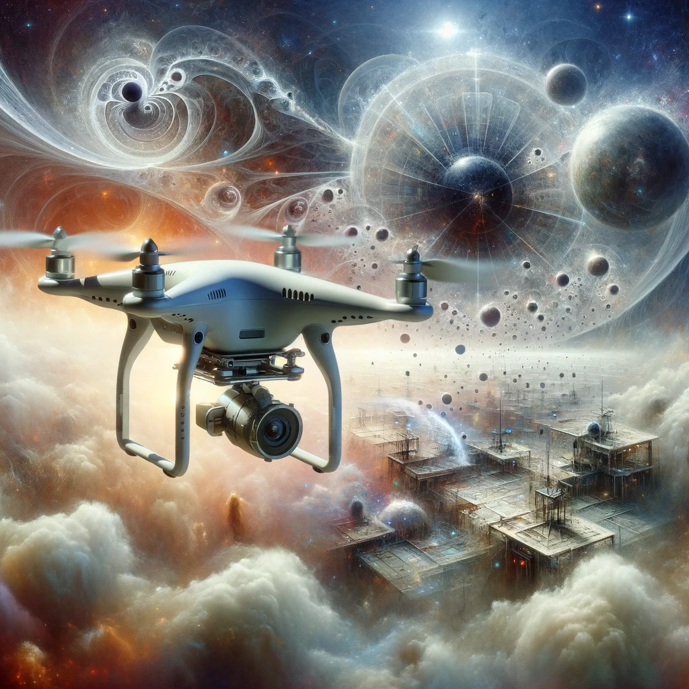
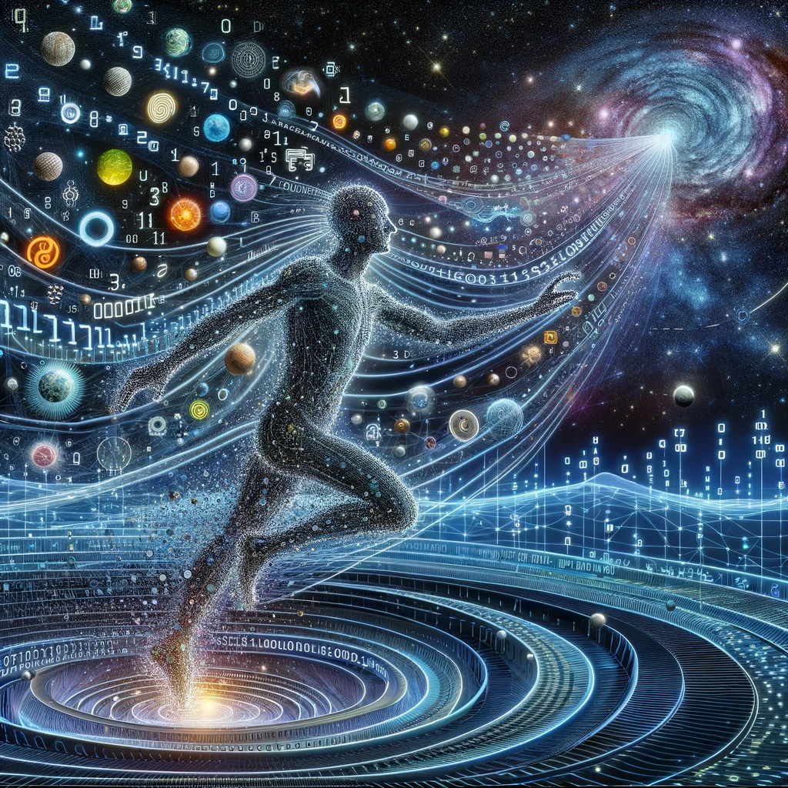
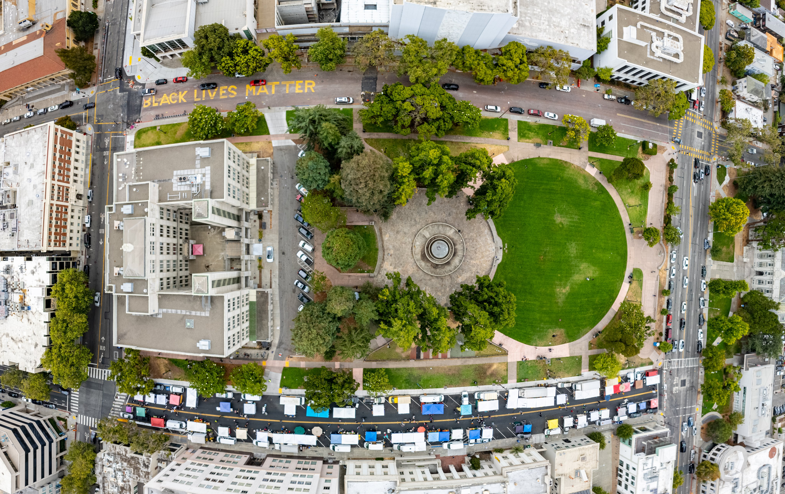
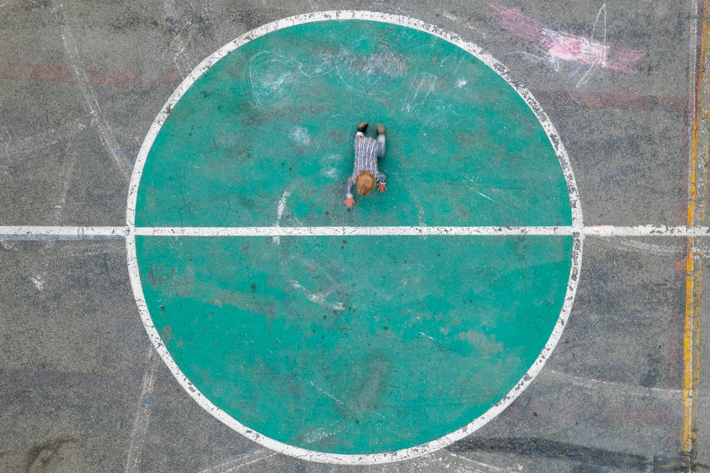
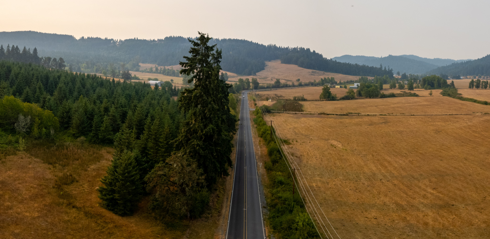
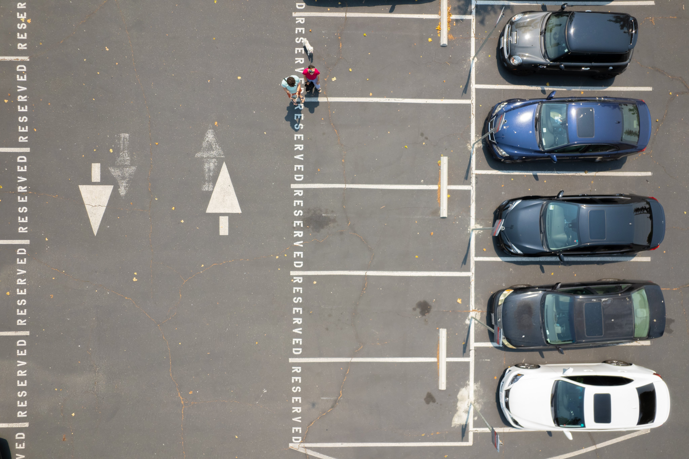
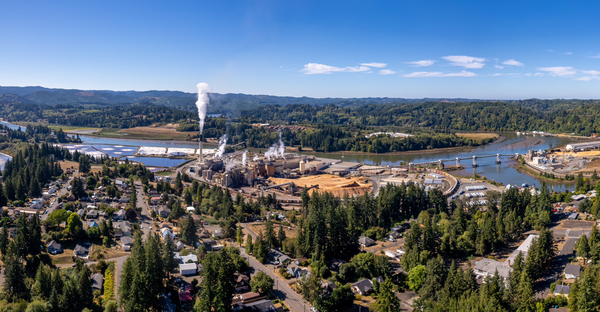
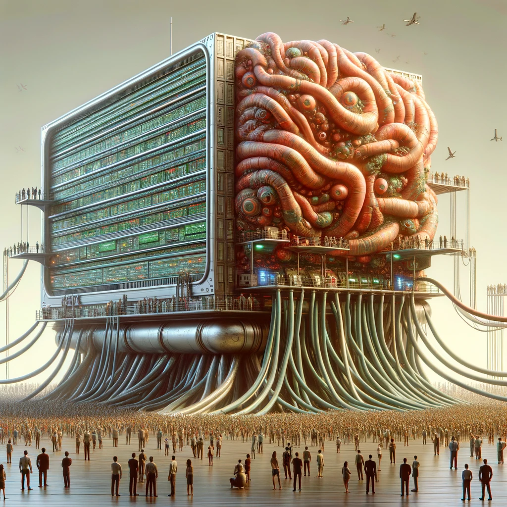

Venkatesh Rao has been on a tear recently with some really insightful posts on AI - if you haven't subscribed to his substack, [Ribbonfarm Studio](https://studio.ribbonfarm.com/), you should.

His recent post "[A Camera Not An Engine](https://studio.ribbonfarm.com/p/a-camera-not-an-engine)" is particularly good.

There he makes the point that, as it turns out, "intelligence" is much the same as data — a structure that can be gathered, browsed, analyzed, processed, and used.

We're used to the idea of data being taken from our heads and the environment and organized together into a dataset or database — but taking "intelligence" from our collective lived experiences and merging them together into a coherent, parseable structure is incredibly novel.

Any dataset can be reliably processed into a sort of frozen "intelligence space".

Venkatesh wrote:

> The specific mechanisms of digesting that data into models don’t seem to matter beyond a point (a Twitter thread I saw argued that the differences among bleeding-edge LxMs are differences among the training data sets, not the minor implementation details or training protocol secret sauces). We might even be getting to some sort of dataset—bounded ceiling: perhaps LxMs are exactly as smart as their training data conceivably could be, or a small delta away from that ceiling.

E.g. one explanation for why the the French AI company [Mistral](https://mistral.ai/)'s new models are so good is supposably they're much more fastidious about cleaning their training data compared to the American giants who've largely just dumped in the entire internet and called it good.

> Once you see intelligence as something embodied by particular pile of data rather than a particular kind of processing, a very powerful sort of decentering of anthropocentric conceits happens; a Copernican consciousness shift gets triggered. You are no more than the sum of data you’ve experienced. A big memory with a small shell script aside. And once you get over the trauma of that realization, you realize something even bigger: any pile of data that has some coherence in its source can be turned into an intelligence that you can relate to, broadening the possibilities of your own existence.

*DALL·E 3's interpretation of the above paragraph*

The blog speculates across a few more areas (go read it!) but I'll leave the post now to explore this idea of a "camera" in latent space.

## Flying Cameras

I've enjoyed photography since I was a child. Starting first with a very short leash on our family's 35mm film camera (photos used to be expensive!) and then with free reign once we got our first digital camera (640x480 resolution!!). I like how it helps me discover new perspectives on the world as I wonder around. I find I can discover new things about even very familiar environments if I have a camera in hand.

Then a few years ago, I got my first drone. What convinced me to buy one was watching Philip Bloom's drone reviews where he calls them "Flying Cameras" (he's a great film maker - his reviews are worth watching even if you have no interest in drones e.g. this one of the [DJI Mini 3 Pro](https://www.youtube.com/watch?v=35U93YnBmE8)).

The drone as a "flying camera" completely changed how I viewed drones. I never quite saw the point of flying something around but having a flying camera that I can send anywhere I like and point it at anything was/is very exciting to me. Just sending a drone up 15 feet gives you a completely unique perspective on the world that's almost impossible to see otherwise.

Here's a [twitter thread with all my early drone experiences](https://twitter.com/kylemathews/status/1419874055679664132).

And a few of the photos I've taken.

*Berkeley Farmers Market*

*Baby Henry crawling around a basketball court at local elementary school*

*Small smoky Oregon valley*

*Cone in baseball field*

*Parking lot*

*Toledo Oregon panorama (where I grew up)*

*Cows in fresh snow*

*Berkeley street scene*

## Photos in latent space

Ok back to latent space.

I'm arguing "prompts as a photograph" is a much more useful metaphor for the latest AI than what other people are proposing e.g. they're reasoning engines or LLMs are roleplaying, etc.

Large models are hyperdimensional static lossy representations of their dataset and prompts elicit specific snapshots from within this space. I like that process to "drone cameras" that we can position and point anywhere within a latent space to take snapshots from that particular perspective.

Writing a prompt is how we position and point the "latent space camera". The output from the prompt is the unique snapshot. And like with photography where we can adjust the perspective, position, exposure, time of day, lightning conditions, zoom, depth of field to change the photograph of the same subject, we can also endlessly tweak our prompts to change the output.

Regular light cameras capture a snapshot of reality. Latent space cameras capture a snapshot of intelligence.

And like with drones, we can send our latent space cameras anywhere within the space.

Ted Chiang got at this idea a bit with his article "[ChatGPT is a Blurry JPEG of the Web](https://www.newyorker.com/tech/annals-of-technology/chatgpt-is-a-blurry-jpeg-of-the-web)"

[Infinite Images and the latent camera](https://mirror.xyz/herndondryhurst.eth/eZG6mucl9fqU897XvJs0vUUMnm5OITpSWN8S-6KWamY) is another interesting exploration.

I asked ChatGPT what it thought about this idea and this is what it came up with:

> **Me:**
>
> what does "latent camera" mean in relationship to prompts to LLMs?
>
> **ChatGPT:**
>
> The term "latent camera" in relation to prompts to Large Language Models (LLMs) like GPT-4 is a metaphorical concept. It's not a literal device but rather a way to describe how an LLM interprets and processes prompts, especially those that involve generating or interpreting images.
>
>In traditional photography, a camera captures an image based on the light reflected from objects. In the world of AI and LLMs, the "latent camera" conceptually captures the essence or the 'latent' features of a prompt. Here's a breakdown:
>
>Latent Space Representation: In AI, particularly in models like GPT or DALL-E, data (text or images) is converted into a high-dimensional space known as latent space. This space represents abstract features of the data, which the model can manipulate or interpret.
>
>Prompts as 'Photographs': When you provide a prompt to an LLM, it's akin to taking a picture with this 'latent camera.' The model 'views' the prompt through its trained understanding, analyzing the words and their associations as a camera would analyze light and shapes.
>
>Interpreting and Generating Responses: Just as a camera processes light to create a photo, the LLM processes the prompt in its latent space to generate a response. This can include creating text, generating an image (as with DALL-E), or interpreting and answering questions.
>
>Complexity and Creativity: The 'latent camera' of an LLM is much more sophisticated than a regular camera. It's capable of creative and complex tasks, like understanding abstract concepts, making associations, and even creating art or poetry.
>
>Limitations and Biases: Like any camera, the 'latent camera' of an LLM has its limitations and biases, based on the data it was trained on and the algorithms it uses. It might 'see' things differently based on its programming, much like how different camera lenses capture different perspectives.
>
>In summary, "latent camera" is a way to conceptualize how LLMs process prompts, turning abstract textual data into meaningful responses, much like how a camera turns light into images.

## Drones can move

While the vast majority of my drone work has been static photos — where I nudged the drone around foot by foot until I got the shot I wanted — it's also really interesting to explore how drones can move in 3d space along paths that are almost impossible to traverse with any other tool. One my favorites is [this video of my drone flying on a foggy day on the Oregon coast descending from above the trees to the forest floor](https://twitter.com/kylemathews/status/1436174216429117441). It's magical to me watching the shift from the cool greys and greens and textures of the fog and tree tops to the warm greens and browns and rich plant life of the forst floor.

And what I've been playing with recently is that our "latent camera" can take video as well. Video is just a series of photos that when played back, create the illusion of movement. Our latent camera isn't limited to snapshots but can actually fly around the latent space of the model taking video.

Here are some of my favorite prompts that I've come up with:

### Technology Zoom Camera

My idea here is you give the prompt any sort of technology and it'll "zoom" into the technology's subcomponents. I've just walkd around the house taking photos of everyday items and it's really fun to learn more about how stuff is made.

Sometimes zooming into sub-components takes you deep into the industrial processes behind seemingly trivial household items e.g. this picture I took of a moisture absorbing container.

ChatGPT responded:

> The image shows a container labeled "Moisture Absorber," which is a product designed to reduce humidity in the air. Let's delve into the technology and its components:
>
>**Moisture Absorber**: This product is designed to attract and trap water from the air, reducing humidity and preventing mold and mildew. The technology is based on the hygroscopic property of certain substances, meaning they can attract and hold water molecules from their surroundings.
>
>**Desiccant**: Inside the container, the most important component is the desiccant. Common desiccants include silica gel, calcium chloride, or activated alumina. They work through adsorption or absorption, pulling moisture from the air onto their surface or into their structure.
>
>**Calcium Chloride**: If calcium chloride is the active ingredient, it's notable for its high hygroscopicity. As a deliquescent substance, it can absorb so much moisture that it dissolves in the water it collects.
>
>**Chemical Production of Calcium Chloride**: Calcium chloride is produced by various methods, including as a byproduct of the Solvay process in the manufacturing of sodium carbonate, or by reacting hydrochloric acid with calcium carbonate.
>
>**Solvay Process**: The Solvay process is a major industrial chemical process that's used to produce sodium carbonate and calcium chloride. It involves the reaction of sodium chloride, ammonia, and carbon dioxide in water.
>
>The technology behind moisture absorbers is deeply rooted in chemical engineering, where control of reactions and an understanding of material properties are essential.

I turned this into a custom GPT — https://chat.openai.com/g/g-sdDRJIFLW-technology-zoom-camera if you'd like to play with it more.

The prompt I've iterated to is:

>For five steps, describe a technology (including any natural phenomenon it relies on and the last significant development in the technology with date (if you're confident about what this is)) and then pick the most important or well-known or charismatic of its sub-components and describe that. A technology is anything that meets a human purpose e.g. media, writing, software, algorithms, consumer devices. or machinery of any sort. If a technology derives from a natural phenomenon, jump to that and then more specific parts of the natural law. Don't pick an adjacent component. The next step must always be a new constituent component of the current technology. 
>
>If you reach a natural element like Aluminium, instead of going into the chemistry of the element, pick its primary ore that's mined and then focus on the mining technology to extract that ore.
>
>In general, choose technologies over natural phenomenons (though still describe which ones a technology relies on) and choose natural phenomenons over delving deeper into the specific chemistry of a material.
>
>If you reach mining and haven't yet hit five steps, circle back to the original technology and pick the second most important, or well-known, or charismatic of its sub-components and continue the process. E.g. for the technology "pencil", you would choose pencil, graphite core, graphite mining, and then return to the pencil wood and then describing logging the wood used in pencils.
>
>Generally people will only include the top-level technology but if they provide a series of subcomponent, follow the ones they choose instead of your own.

## Prompts that program a "flight path" through latent space

Many drones let you program a "flight path" e.g. flying between certain geography points or flying upwards at a 70 degree angle for 250 feet, etc.

What I love about this prompt is it's a repeatable flight path through a particular territory of ideas — the technology component tree in this case.

Once you see prompts as instructions to fly to particular point and then (optionally) fly along a programmed flight path taking a series of photos in a specific way — the possibilities really open up.

Here's a few more of my favorites:

### Randomize story generation around a few attributes

>**You**
>take a short story idea and then retell it 3 times varying randomly the main subject, perspective,  tone, mood, depth of field, and environment. Before each telling of the story, list what you choose for each attribute and then tell the story.
>
>boy meets girl
>
>**ChatGPT**
>
>Story Idea: Boy Meets Girl
>1. Main Subject: Time Travel
>* Perspective: First Person (Boy)
>* Tone: Whimsical
>* Mood: Nostalgic
>* Depth of Field: Focused on Emotional Complexity
>* Environment: Victorian London
>
>Story:  
> I, a time traveler, found myself in Victorian London. Amidst the fog and carriages, I met her, an enigma with a parasol. Each day, I'd leap through time to see her, our conversations a delightful anachronism. But, with every visit, I noticed subtle changes – a glance, a word amiss. I realized, each journey altered our shared moments, painting them with a nostalgic hue, leaving me yearning for a past untouched by time's whims.
>
>2. Main Subject: Alien Encounter
>* Perspective: Third Person Omniscient
>* Tone: Mysterious
>* Mood: Foreboding
>* Depth of Field: Expansive, Cosmic Scale
>* Environment: Dystopian Earth
>
>Story:  
>On a dystopian Earth, he, a lone wanderer, stumbled upon her, not a girl, but an alien entity. The world watched, breath bated, as their encounter unfolded. This meeting, under a blood-red sky, hinted at secrets beyond human comprehension. The air was thick with a foreboding sense of wonder and terror, as if their interaction could determine the fate of worlds. Yet, they stood, two beings from different universes, finding an unlikely connection amidst chaos.
>
>3. Main Subject: Ghostly Reunion
>* Perspective: Second Person (You are the Girl)
>* Tone: Eerie
>* Mood: Melancholic
>* Depth of Field: Introspective, Ethereal
>* Environment: Abandoned Mansion
>
>Story:  
>You roam the halls of an abandoned mansion, a spectral figure. One night, you encounter him, a boy you once knew, now a ghost like you. In this eerie stillness, you both relive faded memories, each echo a reminder of lost love. The mansion, with its creaking floors and whispered secrets, becomes a haven for your melancholic reunion, a space where time stands still, and love endures, even in death.

### See how a characteristic varies across countries

>**You**  
>what is the sterotypical "poor person's food" in different countries in europe?
>
>**ChatGPT**
>The concept of "poor person's food" across different European countries often reflects inexpensive, easily accessible, and hearty ingredients. These foods, originally born out of necessity, have often become integral parts of national cuisines and are cherished for their simplicity and flavor. Here's a look at some examples:
>
>Poland: Pierogi - These are dumplings made with simple ingredients like flour and water, traditionally filled with potatoes, cheese, or sauerkraut. They are a staple in Polish cuisine and were historically a popular, affordable food for the working class.
>
>Italy: Polenta - Once considered food for the poor, polenta, made from ground cornmeal, was a staple for those who couldn’t afford more expensive ingredients. It's versatile and can be paired with various sauces and meats.
>
>Spain: Tortilla Española - A simple, filling dish made with inexpensive ingredients like eggs, potatoes, and onions. This dish originated as a cheap, filling meal for laborers and has become a beloved part of Spanish cuisine.
>
>United Kingdom: Bread and Butter Pudding - A dessert made from stale bread, milk, sugar, and eggs. It's a classic example of British ingenuity in using leftover food to create something delicious.
>
>France: Ratatouille - Originating from Nice, ratatouille is a vegetable stew made with tomatoes, eggplant, zucchini, bell peppers, and onions. Historically, it was a way to use up leftover vegetables and was a common dish among the poor.
>
>Portugal: Caldo Verde - A simple soup made from potatoes, kale, and chorizo. It's a traditional dish that was inexpensive to make and could feed many people.
>
>Germany: Kartoffelsuppe - Potato soup, often made with broth, potatoes, and vegetables. It's a hearty, comforting dish that was historically easy and cheap to make.
>
>Greece: Fasolada - A bean soup often referred to as the “national food of the Greeks.” Made with white beans, olive oil, and vegetables, it’s a nutritious and economical meal.
>
>These dishes reflect the resourcefulness of people in times of scarcity, transforming simple, affordable ingredients into beloved national dishes. It's interesting to note how many of these "poor man's meals" have transcended their humble origins to become cherished culinary traditions.

## Attribute interpolation

Another technique / metaphor I've hit on is *keyframe interpolation*. If you're familiar with animation or video editing software like After Effects, it's what lets you do things like "fade to black". This is done normally by placing a black background behind the video and then iterpolating the *opacity* of the video from 100% to 0% across say two seconds.

You can animate any attribute of videos — opacity, speed, contrast, etc. — many common editing tasks involves keyframe interpolation.

It turns out you can do the exact same thing with our latent cameras, e.g. this prompt.

>**You**
>
>Rewrite this statement from one friend to another interpolating from 100% happy to 100% sad in 10% increments (so rewrite the statement 10 times).
>
>I haven't heard from you in a while 
>
>**ChatGPT**
>
>This task involves rewriting the statement "I haven't heard from you in a while" in a way that gradually transitions from a completely happy tone to a completely sad one, in ten increments. Each version will represent a 10% shift in emotion from happy to sad.
>
>100% Happy (0% Sad): "Hey there! It's been a moment since we last chatted, I hope you're having an adventure out there!"
>
>90% Happy (10% Sad): "Hi! I've noticed it's been a little while since we last caught up. Hope all is well and exciting in your world!"
>
>80% Happy (20% Sad): "Hello! It's been some time since our last conversation. I'm missing our chats but I'm sure you're busy with fun things!"
>
>70% Happy (30% Sad): "Hey, just realized it's been quite a while since we last spoke. Hope you're doing okay and finding some joy in your days."
>
>60% Happy (40% Sad): "Hi, it's been a significant amount of time since we've talked. I'm starting to miss our conversations, hope everything's alright."
>
>50% Happy (50% Sad): "Hello, I can't help but notice it's been quite long since we last connected. I hope you're doing okay, I'm here if you need to talk."
>
>40% Happy (60% Sad): "Hey, it's been a while since we've spoken. I'm beginning to worry a bit, just hoping you're in a good place."
>
>30% Happy (70% Sad): "Hi, I've realized it's been a really long time since our last conversation. I'm quite concerned, I hope you're managing okay."
>
>20% Happy (80% Sad): "Hello, it's been too long since we last talked. I'm feeling quite sad about it, just hoping you're safe and well."
>
>10% Happy (90% Sad): "Hey, it's been an incredibly long time since I've heard from you. I'm deeply worried and missing you a lot, hope you're alright."
>
>0% Happy (100% Sad): "It's been such a long time since I've heard from you. I'm feeling really down about it, just wishing to know if you're okay."
>
>Each iteration reflects a subtle shift in emotional tone, representing the changing balance between happiness and sadness in the context of missing a friend.

You can tell ChatGPT to interpolate literally anything. You can easily come up with some pretty bizarre and funny stuff by interpolating things out of their normal range e.g.

>**You**
>
>Describe 3 times in a deft, wry, journalistic tone, using less than 40 words, a man using a shovel — gradually increasing the shovels length from 1 foot to 20 feet
>
>**ChatGPT**
>
>"In a comical twist of DIY, local man tackles garden woes with a one-foot shovel, proving size isn't everything – except in digging efficiency."
>
>"Suburban spectacle: Man with 10-foot shovel attempts yard work, neighbors debate practicality versus sheer absurdity of his 'innovative' tool choice."
>
>"Breaking: Man with 20-foot shovel turns heads, defies physics and common sense in backyard endeavor. Lawn care or performance art? Jury's still out."

This is similar to the ["Make it more" meme](https://knowyourmeme.com/memes/make-it-more-ai-trend) that's been going round.

I think this idea of flying through a particular idea space is also the source of the enduring appeal of searching/browsing wikipedia, reddit threads, twitter, youtube, tiktok, Amazon reviews, etc. — to do a quick scan of some slice of humanity's intelligence.

## “A change of perspective is worth 80 IQ points.”
Alan Kay's famous quote gets at where this can get really valuable. Perhaps the most useful AI copilots will be ones that are continually helping us view a problem or set of concepts from different perspectives.

Next time your're faced with a problem, try writing a prompt that captures the problem and then identify all key attributes on which your perspective could vary on the subject and then ask the LLM to interpolate through all the possible perspectives.

(Though [Douglas Adams](https://hitchhikers.fandom.com/wiki/Total_Perspective_Vortex) and [Bill Watterson](https://www.reddit.com/r/calvinandhobbes/comments/aw7k2x/neocubist/) would warn against trying to absorb *too* many perspectives).

This prompt does a pretty good job guiding you through this process:

>The user is looking for additional perspective on a problem or idea. Your job is to take their description of what they're thinking about and suggest 10 key attributes on which they might look for different perspectives on. Suggest those to them. Ask them to pick 3 of them. Take those 3 attributes and generate 9 new perspectives on the problem or idea by varying the different attributes they picked. Output for each nine how you changed the attribute(s) and then what's different and what they might be able to learn from it.
>
>If the user doesn't immediately provide the problem or idea, simply ask them to provide it.

We're all connected now to these bizarre but amazing databases of human intelligence. We might as well get good at them.

Come up with an interesting prompt? I'd love to see it! Share it on [Twitter](https://twitter.com/kylemathews/status/1737633927937085816), [Warpcast](https://warpcast.com/~/conversations/0x1dd60ed3aede0ea704a365d16c624a6eac18bcdd), or [Bluesky](https://bsky.app/profile/kam.bsky.social/post/3kgzdnes4j22x).

