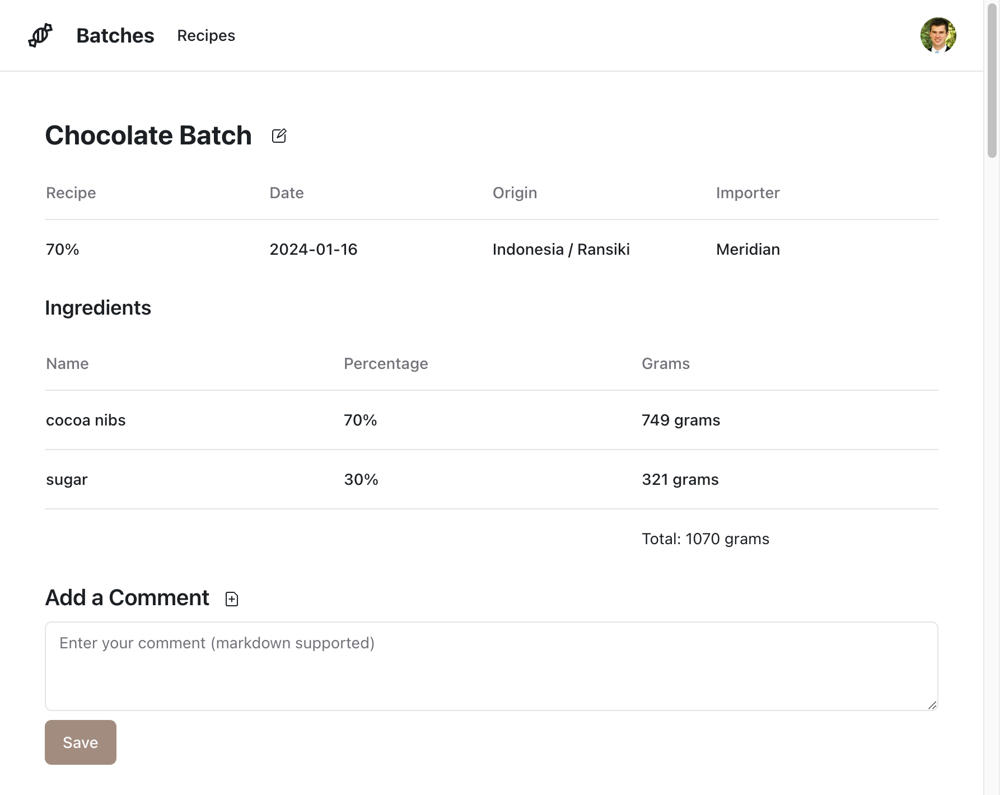
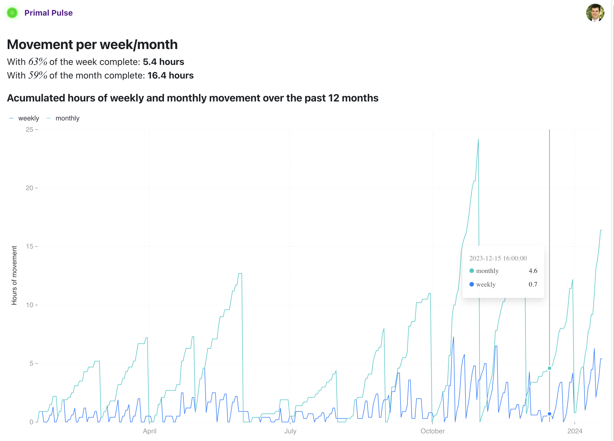

In the past week I built and deployed two micro-apps.

I was curious what exactly would take the most time so took fairly detailed notes as I went so I could write this post.

First a bit about the apps and then I'll breakdown the time spent and draw a few implications.

### Chocolate Batches ([code](https://github.com/KyleAMathews/chocolate-batch-tracker))

My wife and I have gotten into making bean-to-bar chocolate over the last year. If you like cooking and you like chocolate, it's a very fun (and delicious) hobby. I'll be writing a separate post about this soon actually.

We didn't have a consistent way to store information about what we were making, recipes and origins
we were trying, and tasting notes. We had a spreadsheet but it's fiddly to use and extend.

So I thought that of course, a new little micro-app would be great for this.

### Primal Pulse ([code](https://github.com/KyleAMathews/primal-pulse))

My goal this year is to get to 12 hours of movement / week. Inspired by [Alan Couzens](https://twitter.com/Alan_Couzens) research on how fundamental large volumes of low intensity movement is to good health and as the foundation to all fitness. The name "Primal Pulse" is after the idea that our bodies evolved to work like they did in pre-modern societies i.e. moving all the time. And that much of our health/fitness issues trace to that we're resting constantly.

So a good option for a micro-app to track this. I record all my activities from my Garmin watch (walks, runs, bike rides, resistance workouts, etc.). I wrote a script that pulls the data from Garmin and writes to a Postgres database which syncs to my client with [ElectricSQL](https://electric-sql.com/) where I create the chart of weekly/monthly movement (with a [fancy SQL query](https://github.com/KyleAMathews/primal-pulse/blob/7ba6a240e5a3c981df0583a36fd7226f494df0f0/src/routes/index.tsx#L155-L186) that ChatGPT made for me).

I'm currently around 5-6 hours / week of movement so a ways to go still.

## Hours

It took ~19 hours to build the Chocolate batches app and ~9 hours to build the Primal Pulse app, spread over the last week or so.

For the Chocolate app I spent:
- 2 hours on design (typography, colors, general layout)
- 9 hours on interactivity (forms, etc)
- 4 hours setting up dev environment
- 4 hours setting up prod environment

For the Primal Pulse app I spent:
- 2 hours on dev/prod setup
- 1 hour on fine-tuning the chart (I had a similar one on a previous app that I ported over).
- 6 hours researching/learning new tools — most of which was finding the best way for longer-running serverless functions. I evaluated half a dozen tools before settling on [SST](sst.dev)'s setup for AWS Lambda functions.

## Analysis

The most general conclusion I can make is that doing anything novel takes much much longer than anything I'm repeating.

This is the 5th ElectricSQL app I've built — I've been slowly converting everything I'm learning into a reusable project starter and standard production environment which I repeat on every project. So both the "setup dev and prod" workflows are getting a lot lot faster.

E.g. setting up my basic development environment for my ElectricSQL apps. I first hand did this with Vite and React last fall over a day or two, etc. then spent a day converting that into a starter which I've since refined over 5 apps now. That's days of work to learn those things which is now compressed into running one command and about 3 minutes of work to get going on a new project.

It's the same with my production environment. It took two days to figure out everything when deploying my first app. Now it's a checklist I follow that takes me ~1 hour. And I'm planning on adding some minor automation that'll cut that in half again.

You can see that across these two apps. Just with the experience from the chocolate app, I went from ~8 hours total for the chocolate app to ~2 hours for primal pulse to set up dev/prod.

You can just ferociously compress how long it takes you to do simple things — as long as you repeat them a few times.

I read a great book recently: [How Big Things Get Done](https://www.amazon.com/gp/product/B0B3HS4C98/ref=ppx_yo_dt_b_search_asin_title?ie=UTF8&psc=1). A very readable and insightful book into what factors make large and small projects go well and fast or slowly fail. Two factors he discusses are the role of experience and modularity. Which in my mind are often the same thing. If you can make your tools and workflows "modular" i.e. reusable across multiple projects, then you'll go up the experience curve on these much faster than if they're slightly different on every project.

In general, the most optimal tools and workflows aren't those that are optimal in some sort of global sense, i.e. do the most possible things for you the quickest but those that are small and simple and reusable in many contexts. You can get ridiculously good at these small things fairly quickly and find lots of ways to use them where the more complicated the tool, the harder it is to actually master and the fewer opportunities you'll find to use them.

The book talks about how nuclear plants are incredibly complex to build and how each plant tends to differ quite a bit from every other plant — so there's very learning across plants. And compares them to solar panels where a single solar cell is repeated millions of times. Solar projects are very predictable as to time and costs and the cost / GW for solar has dropped precipitously for decades. Whereas nuclear energy seems to just get more and more costly over time.

[Learning Curve](https://en.wikipedia.org/wiki/Learning_curve) is the technical term for these ideas for those looking for the Wikipedia link.

So this is my grand strategy (as it were) right now — I'm looking for what to do next and the only way I know to do that is to prototype as many interesting things as possible and then eventually double-down on the most interesting. So I need an approach that optimizes for prototyping time.

React is my old standby and ElectricSQL is a new tool that eliminates a lot of setup and development time and gives you free real-time sync. I'm also finding that just using raw VMs & Lambdas are proving much faster than working with PaaSs as I have a lot more flexibility to do weird stuff and don't run into paywalls whenever I try to do something novel.

A well-practiced, modular set of low-level tools allows for fluid exploration of higher-level concepts.
