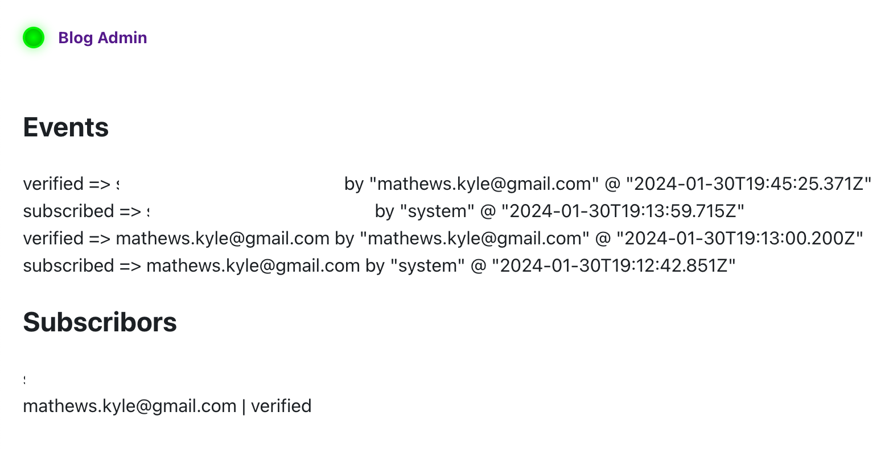

I've been avoiding adding a newsletter to my blog for months now. It's an
obvious thing to do and people ask for it now and then but it just seemed...
hard.

Then it occurred to me yesterday why — adding integrations suck. The obvious
ways to add newsletter support was to either use a dedicated newsletter service
which takes care of most things or to use a lower-level email API
and manually hook it up a bit. But either way, it'd mean reading a bunch of
docs, getting confused for a while, and writing some tedious, probably difficult
to debug, code.

What I realized though is there's another way to do this — I'm not trying to
sign up 10s of thousands of people here, I can probably just do this manually.
I can manually send out verification emails and manually send out each
"newsletter" for each blog post I write just by copy/pasting the post and email
addresses into gmail.

It's not particularly hard to send a few verification emails each day. But it
is hard to send 100s of emails each day.

This is very "do things that don't scale" Y Combinator style — which is the
right strategy both because you learn more by doing things manually e.g. I
can perhaps turn verification emails into a bit of a conversation and you avoid
expensive automation for "things that scale" as they have high fixed cost and
you're better off avoiding them until you're sure you actually need them.

This is a good example of why problem decomposition is valuable. When I looked
at the problem as a whole of a blog email newsletter, it seemed like I had to
use a service. But when I split up the problem into three:

1. People want to subscribe
2. I need to verify email addresses are real
3. I need to send out the email newsletters to the current list of subscribers

I realized only the first one needed code at all (in theory people could just email
me if they wanted added but that'd probably have an unacceptably low conversion rate)
and the second two could be done manually.

The famous architect and theorist [Christopher
Alexander](https://en.wikipedia.org/wiki/Christopher_Alexander) gave a nice
process for decomposing problems in his book [Notes on the Synthesis of
Form](https://www.amazon.com/dp/0674627512?tag=doriantaylor-20) (worth
reading).

First, that "intractable complex problems are solved by breaking them down into
simpler, more tractable ones".

Second, that "for a given problem there are ways to take it apart that are
better than others, and indeed there is often a single, unique decomposition
pattern that is objectively better than the rest."

And third, that "Alexander rather innovatively defined a 'design problem' as a
network of interacting concerns, such that any two interconnected concerns must
be satisfied in tandem. Since the entire network was connected, this meant the
problem set couldn’t be broken down without severing certain connections.
Alexander’s dissertation showed not only how this could be done, but why it
should be done by severing the fewest connections possible."

(I borrowed this summary from this great post https://dorian.substack.com/p/at-any-given-moment-in-a-process)

The only thing connecting my decomposed three problems for my newsletter is
the list of subscribers — so this decomposition satisfies Alexander's "sever
the fewest connections possible" advice.

So with the mental block removed, I whipped out the code yesterday
afternoon and this morning and I'm now the proud owner of the world's simplest
email newsletter setup!

There's a form at the end of each post to add your email (feel free to take a
bit of time to go add your email before finishing). This submits to a Gatsby
function which writes out the data to a Postgres db & sends me a Slack
notification so I can send the verification email.

This is all hooked up via [ElectricSQL](https://electric-sql.com/) to a
one-screen admin app where I can see subscribers & get emails to send
verification and newsletter emails.

All in all it took me about 3.5 hours to build — 2.5 hours to develop and 1
hour to deploy (ran into some odd errors). There are [two
tables](https://github.com/KyleAMathews/blog/blob/master/admin-app/db/migrations/001-create-tables.sql),
[an 85-line admin
component](https://github.com/KyleAMathews/blog/blob/master/admin-app/src/routes/index.tsx),
and a [99-line API
Function](https://github.com/KyleAMathews/blog/blob/master/src/api/register.ts).

It's fun having a blog admin now. I have no idea what else I'll do with it but
now that it's there, it's trivial now to add other interactive bits to the
site. We'll see if I think of anything.
