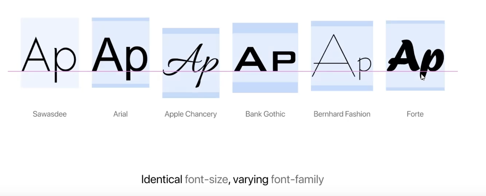

I really enjoy typography — which causes pain when developing for the web. Because the web
makes it hard to deeply control text layout.

This [talk](https://fantasai.inkedblade.net/style/talks/atypi-2021/atypi-2021-precise-text-alignment.mp4)
 (about some in-progress fixes for the web's typographic woes) has a slide which sums up the issue.

The same `font-size` and `line-height` settings result in vastly different
layouts on the page. You might think that setting your font-size to `16px`
would mean that the text would thent take up `16px` of height on the page — but
you would then be very wrong.

There's platform fixes in progress (as the video above discusses) but in the meantime,
a number of folks across the industry have created a fix called [Capsize](https://seek-oss.github.io/capsize/).
 A lot of research and code has gone into wrestling fonts and browsers into consistently rendering fonts.

It's brilliant and you should drop whatever you're doing to integrate it into your current project.

Precise layout gets a lot lot easier.

The one downside of Capsize is it's pretty low-level. You have to write quite a bit of code to
fully integrate it into your design system.

I've recently standardized on [Radix](https://www.radix-ui.com/) for my projects as it has a very
well-thought out layout, typography, and color system & a growing list of
components to choose from. It's really brilliant and I think anyone looking to
build a design system should build on their work.

And as they have a simple way to [customize typography through CSS
variables](https://www.radix-ui.com/themes/docs/theme/typography#customization),
after some digging and experimentation, I created a Vite plugin which takes a
small config object and spits out a Capsize/Radix typography css file.

The code and docs are at https://github.com/KyleAMathews/vite-plugin-capsize-radix-ui

[Check out the demo](https://vite-plugin-capsize-radix.bricolage.io/) — notice
how the text doesn't move even a pixel up and down as I switch between fonts — this
is incredible and impossible without Capsize. The practical benefit of this is
it makes it trivial to try out different fonts as you're building your app
without breaking your layout.

<video controls width="100%">
  <source src="https://github.com/KyleAMathews/vite-plugin-capsize-radix-ui/assets/71047/3ec5d6ca-bf00-4b79-8552-4e3da3454f52" type="video/mp4" />
</video>

I'm curious what people think — I love each of these tools and together they're 🧑‍🍳 

I think a similar tool could be built for integration with other popular
component libraries. Feel free to copy the approach.

