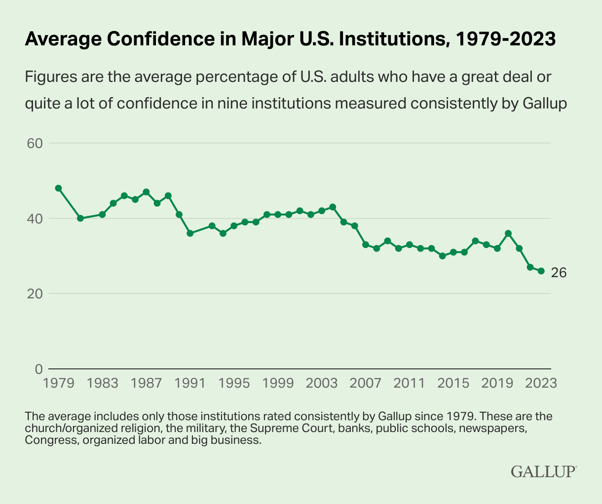

Here’s a quick sketch about why I think protocols are so important and why I think protocol design is a practical skill for many of us to learn.

I’ve been loosely involved with the [Summer of Protocols](https://summerofprotocols.com/) program since last year and have eagerly been following the discussions and reading their essays as they come out.

They’re tackling one of the largest problems facing the world right now — that the institutions we rely on to guide collective decision making and behaviors are struggling to adapt to the changing world. This is most clearly measured by the long-term drop in the confidence people have in important institutions. 

There’s a lot of discussion about why this is happening. My preferred theory atm is it’s a combination of _scaling problems_ — institutional practices invented in the previous decades and centuries are not scaling well as the world grows larger and more complex. And then the mother of all disruptions, _the internet_, which changed how humanity senses the world — which disrupts many of the underlying mechanisms supporting institutions.

But regardless of _why_ it’s happening — we _have_ to fix it. Institutions _have_ to work — history shows over and over that when institutions stop working, society falls into anarchy and terror.

So the stakes couldn’t be higher.

How are the growing collective of researchers and practitioners around Summer of Protocols tackling this issue? They’re trying to create a powerful new way of thinking about protocols that’ll uplevel our collective imaginations and capabilities so that we can all iterate faster towards better ways of running the world.

## What are Protocols?

What exactly are Protocols? My preferred simple definition for protocols is _any set of behaviors that make something more likely to happen_.

Protocol Theory encompasses a huge range of related topics — habits, rules, laws, policy, frameworks, software protocols, algorithms, conventions, and standards. So it’s not a new topic — legal frameworks have existed for 1000s of years and religions and philosophers have long provided detailed sets of rules for living.

Venkatesh Rao, one of the co-founders of Summer of Protocols, [commented on this strangeness of Protocol Theory feeling new despite being very old](https://studio.ribbonfarm.com/p/in-search-of-hardness):

>This is rather odd, if you stop to think about it. Why do protocols feel like an __emerging__ world even though they’re clearly not?
>
>Despite its antiquity and size, and despite all the recent drama around modern crypto technologies, the world of protocols is a strangely hidden one. Even though there are hundreds of millions of people around the world who explicitly organize their work and thinking around protocols of various sorts, the __language__ of protocols is not a familiar one. It is easier to look __through__ protocols than __at__ them. It is easier to act __through__ protocols than __on__ them. It is easier to systematize an emergent local practice into a bespoke local protocol than to think about the general features of __all__ protocols.

Protocols again aren’t _new_. They just haven’t been important enough in the past to emerge as their own field. As Venkat puts it, “protocols are evolving from an artisan craft to an engineering and art domain.”

## See the Protocols

Protocols thoroughly permeate our lives. There are 100s of protocols embedded in the walls of our homes. We follow dozens throughout our day-to-day lives from brushing our teeth to which side of the road we drive.

But like the [famous “how’s the water?” fish story](https://fs.blog/david-foster-wallace-this-is-water/) — for most of us, if someone asked “how’s your protocols?” we’d also respond “what the hell is a protocol?”

To successfully adapt our institutions, many of us are going to need to get a lot more comfortable at seeing the “water” of protocols that surround us.

It’s common for individuals or organizations to figure out how to get good outcomes but often the protocols that led to those good outcomes don’t spread beyond the initial innovators — often because the original people involved don’t fully understand the protocols they created!

The world is full of “[just-so stories](https://en.wikipedia.org/wiki/Just-so_story)” about why or why not someone or a group was successful. Protocol Theory can help us tease out the underlying protocols and sources of hardness that led to the success and help these protocols reproduce much more readily elsewhere.

## Engineer the Protocols

Protocols Theory is the CAD software, CNC machines, jigs, dies and molds, assembly lines, and quality control for mass manufacturing good outcomes.

There needs to be tens of thousands of skilled protocol engineers and machinists designing and building the new protocols for the new world we find ourselves in.

Given that an institution is just a big set of nested protocols, how can they learn to experiment faster around new hardness/protocol ideas, correctly identify improved protocols (avoiding capture by bad actors), and help their constituents migrate?

This seems like the most important question of our time, can our institutions successfully evolve to meet the conditions and problems of today? The answer to this question will determine how pleasant (or otherwise) the next 100 years will be. Hopefully the next 40 years will see a steady upward trend in the average confidence in major institutions.

## A Protocol Age

Josh Stark compared Protocol Theory to Information Theory in his essay [Atoms, Institutions, Blockchains](https://stark.mirror.xyz/n2UpRqwdf7yjuiPKVICPpGoUNeDhlWxGqjulrlpyYi0). Not until [Claude Shannon published his Information Theory in 1946](https://en.wikipedia.org/wiki/Claude_Shannon#Information_theory), did the now common abstraction of “information” or “data” exist.

Information Theory created a powerful new way of seeing the world as full of discrete information which is stored, transmitted, and processed. This new perspective helped inspire a whole generation of technologists to imagine and successfully invent technologies like the CPU, fiber optics, and the internet. Information Theory led to the Information Age.

Perhaps Protocol Theory is also laying the foundation for a coming Protocol Age?
