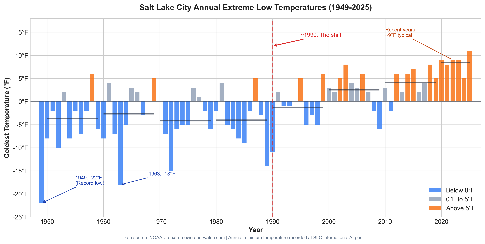
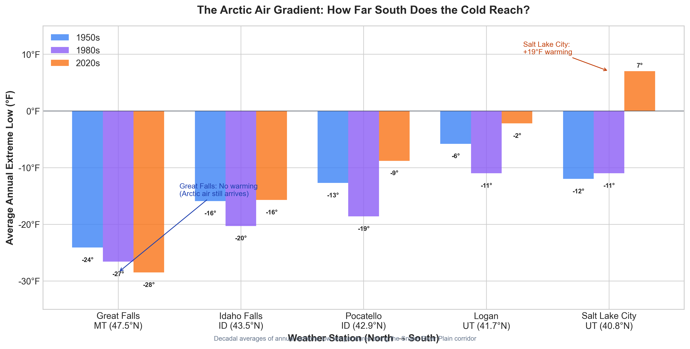

People in Salt Lake City are growing figs.

I discovered this within weeks of moving here from the Bay Area. The local Facebook gardening groups were full of photos—someone's Chicago Hardy fig, branches heavy with purple fruit; pomegranates ripening on the tree; persimmons; even the occasional olive surviving winter. Comments overflowed with variety recommendations and overwintering tips, as if growing subtropical fruit in the shadow of the Wasatch Mountains was... normal?

I'd grown up on the Oregon coast—Zone 9-10, where the coldest winter nights rarely drop below 20-30°F. You can grow almost anything in those conditions. Moving to Utah, I'd mentally prepared to give up on tender fruits. Figs were for California. I'd be a responsible mountain gardener now, sticking to apples and cherries.

*But wait—isn't Utah supposed to be cold?*

Then this winter happened, and I started wondering: what's actually going on?

## This Winter: What's Happening?

December 2025 was Salt Lake City's warmest December in over 100 years. On December 22nd, we hit 67°F—a record for that date. People were walking around in t-shirts. Christmas Day reached 60°F, shattering a 70-year-old record; I saw kids on bikes, neighbors grilling outside. My fruit trees started budding. In December. We hadn't seen measurable snow in 284 days.[^8]

But here's what made it strange: it wasn't just us.

Western Montana—places like Missoula and Kalispell—had one of their top 5 warmest Decembers on record. Idaho is in a "warm snow drought"—precipitation is falling as rain, not snow. The arctic air has simply stayed up north.

Is this the new normal? Have winters just... stopped being cold?

I started digging into the data, and what I found was more nuanced. Yes, 2025 was Salt Lake City's warmest year on record—57.7°F average, 3°F above normal. But the more interesting pattern emerges when the arctic air *does* come south.

Last January—January 2025—an arctic outbreak pushed down from Canada. Great Falls, Montana plunged to -29°F. Idaho Falls dropped to -18°F with wind chills hitting -32°F, prompting the National Weather Service to issue their first-ever "Extreme Cold Warning" for the region.

And Salt Lake City? Our coldest night during that same outbreak was 15°F. Cold, sure. But 44 degrees warmer than Great Falls during the same weather event. The arctic air barreled down from Canada, hammered Montana, froze Eastern Idaho... and stopped before reaching us.

*That's* what caught my attention. Not just the warm winters—but what happens when the cold does come. It's like there's a wall somewhere between Logan and Salt Lake City.

That felt like a clue. So I started digging into the historical data.

I learned about the USDA zone changes. Salt Lake City had shifted from Zone 6 to Zone 7. That's a significant jump—the difference between "figs die every winter" and "figs usually survive."

But *when* did this change? And *how*? Was this a gradual warming, or something more sudden?

## The Chart That Started Everything

I pulled the annual extreme low for Salt Lake City—the single coldest night each winter.[^9] For perennial plants, this is the only number that matters.

A fig tree doesn't care about mild Januaries or warming averages. What kills it is one night at -10°F. You can have 364 perfect days, but if night 365 drops to -15°F, your fig is dead. That's why USDA hardiness zones are based solely on this metric.

What I expected was a gradual warming trend, the kind of slow creep you hear about in climate discussions.

What I found was a cliff.

From the 1950s through the 1980s, Salt Lake City regularly plunged to -10°F, -15°F, sometimes -20°F or colder. The all-time record low of -30°F was set in February 1933, before this dataset begins. These weren't freak events—they were *normal winters*.

Then, starting around 1990, the floor dropped out. The annual extreme lows jumped from the negative teens to... the positive single digits. Recent years have barely touched 9°F. That's not a gradual warming trend. That's a 20°F shift in the span of a generation.

This explains why old-timers say "you can't grow figs here" while newcomers are harvesting them. They're both right—they're just talking about different climates.

But what *caused* such a sudden shift? I started reading about Utah's winter weather patterns and came across a concept that changed how I understood everything: arctic air incursions.

## The Arctic Highway

Here's something I didn't fully appreciate before moving here: the killer freezes in Salt Lake City aren't caused by "cold winters" in the normal sense. They come from *arctic air incursions*—massive domes of frigid air that occasionally break loose from Canada and plunge south into the United States.

And there's a geographic reason Utah is vulnerable to these events. Look at a topographic map and you'll notice something: there's a relatively flat corridor running from Montana, through southern Idaho (the Snake River Plain), directly toward the Great Basin. Cold air is dense. It flows through valleys like water through channels. The Snake River Plain acts as a highway, funneling arctic air from the Canadian border straight toward Salt Lake City.

This got me wondering: if arctic air *used* to reach Salt Lake City regularly but doesn't anymore, what's happening further north? Is the arctic air still traveling down that highway, just not making it all the way? Or has something changed at the source?

I decided to check. If you wanted to measure how far south an arctic air mass penetrates, you'd look at weather stations along the route—like checking river gauges to see how far a flood traveled. So I pulled the same annual extreme low data for stations along the corridor: Great Falls, Montana. Idaho Falls and Pocatello, Idaho. Logan, Utah. And Salt Lake City.

## The Measuring Stick

What I found was striking.

| Station | Latitude | 1950s Avg | 1980s Avg | 2020s Avg | Change |
|---------|----------|-----------|-----------|-----------|--------|
| Great Falls, MT | 47.5°N | -24°F | -27°F | -29°F | **Colder** |
| Idaho Falls, ID | 43.5°N | -16°F | -20°F | -16°F | No change |
| Pocatello, ID | 42.9°N | -13°F | -19°F | -9°F | +4°F |
| Logan, UT | 41.7°N | -6°F | -11°F | -2°F | +4°F |
| Salt Lake City, UT | 40.8°N | -12°F | -11°F | +7°F | **+19°F** |

Great Falls, Montana—at the top of the corridor—hasn't warmed at all. If anything, it's gotten *slightly colder*. The arctic air is still coming.

Idaho Falls and Pocatello show modest changes. Logan has warmed a bit. But Salt Lake City? Roughly a 19°F warming in annual extreme lows. That's off the charts compared to the stations just a few hundred miles north.

The pattern is unmistakable: the further south you go along this corridor, the more dramatic the warming. There's a gradient, and it gets steeper as you approach Salt Lake City.

But here's what really convinced me. I compared last winter's January 2025 arctic outbreak to the February 1985 outbreak—one of the most severe on record.

**February 1985:**
| Station | Temperature |
|---------|-------------|
| Great Falls, MT | -37°F |
| Idaho Falls, ID | -38°F |
| Salt Lake City, UT | ~0°F |

**January 2025:**
| Station | Temperature |
|---------|-------------|
| Great Falls, MT | -29°F |
| Idaho Falls, ID | -18°F |
| Salt Lake City, UT | +15°F |

Look at those numbers again. Same pattern: arctic air plunging south from Canada. Same geographic corridor. Same terrain barriers between the stations.

In 1985, Great Falls and Idaho Falls hit *essentially the same temperature*—negative 37 and 38. The arctic air mass was so deep and so cold that it flowed over every obstacle like water over a low dam. Four hundred miles of mountains, valleys, and terrain gaps barely touched it. By the time it reached Salt Lake City, the air had only warmed to 0°F.

Now look at 2025. Great Falls hit -29°F—similar to 1985. The arctic air was still coming. But by Idaho Falls, it had already warmed 20 degrees. And Salt Lake City? Fifteen above zero—*44°F warmer* than Great Falls during the same weather event.

The terrain barriers between these stations haven't moved. The mountains didn't get taller. But something fundamental changed about how cold air behaves on its journey south. The same cold that punched through everything in 1985 now gets stopped somewhere along the way.

This is the smoking gun: the arctic air is still barreling down that highway. It's just *shallower* now. And shallow cold air pools in basins but can't climb over mountain ridges.

## Why Logan Freezes and Salt Lake Doesn't

So what's happening in those 80 miles between Logan and Salt Lake City? Why does the same arctic air mass that brings -10°F to Cache Valley arrive as a mild cold snap in Salt Lake?

(If you're in Logan, by the way, none of this helps you. Your figs still die.)

Think of the terrain like a dam. The Wellsville Mountains and canyon corridors between Cache Valley and Salt Lake create a barrier that shallow cold air can't easily cross. Cold air is denser than warm air—the molecules pack closer together—so it hugs the ground and behaves like a fluid. When the cold layer is deep enough, it flows over the barrier. When it's shallow, it gets stopped.

**The dam hasn't changed. But the cold river got shallower.**

An arctic air mass doesn't stay cold just because it started cold.[^7] As it travels south, it maintains temperature primarily through contact with snow-covered ground—like a drink staying cold against ice in a cooler. Snow reflects sunlight and radiates heat away at night, keeping the air mass deep and cold. Bare ground means mixing with warmer surface air, arriving shallower and modified.

This explains the "cliff." **The entire corridor—Montana, Idaho, northern Utah—now has less reliable snow cover.** Without that cold surface to couple to, arctic air masses shallow out before reaching Utah's northern border—too thin to spill over terrain barriers.

- **1950s-1980s:** Arctic air traveled over reliably snow-covered ground, stayed deep and cold, overflowed terrain barriers, reached Salt Lake at -10°F to -20°F
- **1990s-2020s:** Less snow cover along the path, air mass warms and shallows faster, terrain barriers now effectively block what's left, Salt Lake sees single digits at worst

Cache Valley is a trap. Picture it from above: mountains on three sides, the north side wide open—a funnel pointed directly at Canada. When arctic air pours through, it has nowhere to go. It pools on the valley floor, sometimes 40°F colder than the ridgelines a few hundred feet up.[^5] Logan residents know this intimately; they drive up out of the frozen fog into sunshine and realize the "cold snap" exists only in their bowl.

Salt Lake Valley *should* work the same way. But it doesn't, quite. The bowl leaks—canyons connect it to other basins, letting cold air drain away. The Great Salt Lake, too saline to freeze, breathes 35°F air across incoming arctic masses. And then there's the city itself: asphalt, concrete, a million furnaces. Measurements put Salt Lake's urban heat island at 7°F of nighttime warming—which lands precisely when arctic air is coldest and your fig tree most vulnerable.[^6] Seven degrees is the difference between "root damage" and "dead."

The mountains didn't get taller. But the cold domes now arrive thinner and more modified—less time over snow, less coupling to a cold surface. That's why the annual extreme low in Salt Lake City fell off a cliff around 1990, even as Great Falls kept getting hammered.

## What the Science Says

I went looking for academic research to see if my station-by-station analysis held up. It does.

Cold air outbreaks are declining across North America—in spatial extent, frequency, duration, and magnitude.[^1] The underlying driver is "Arctic amplification": the Arctic has warmed 2-4 times faster than the global average since the 1970s. As sea ice melts, it exposes dark ocean water that absorbs sunlight instead of reflecting it, which warms things further and melts more ice—a self-reinforcing cycle. Warmer Arctic temperatures mean the source region for cold air outbreaks isn't as cold as it used to be.

Research on Idaho confirms the regional pattern: 7 of Idaho's 10 warmest years have occurred since 1990, the freeze-free season has lengthened by two weeks, and the altitude where precipitation turns from rain to snow has risen 500 feet.[^3] Meteorological studies confirm that the Snake River Plain genuinely does funnel arctic air southward, and that the terrain barriers I've described genuinely do block shallow cold air masses.[^4]

What I pieced together from weather station data matches what climate scientists have been documenting for years. The arctic air highway is still open, but the traffic has gotten warmer. And Salt Lake City sits just past the point where terrain, lake effect, and urban heat finally stop it.

[^1]: Smith, E. T., & Sheridan, S. C. (2020). Where Do Cold Air Outbreaks Occur, and How Have They Changed Over Time? *Geophysical Research Letters*, 47(13).

[^3]: Abatzoglou, J. T., Marshall, A. M., & Harley, G. L. (2021). Observed and Projected Changes in Idaho's Climate. University of Idaho.

[^4]: Steenburgh, W. J., & Blazek, T. R. (2001). Topographic Distortion of a Cold Front over the Snake River Plain and Central Idaho Mountains. *Weather and Forecasting*, 16(3), 301-314.

[^5]: Wang, S. Y., Gillies, R. R., Martin, R., Davies, R. E., & Booth, M. R. (2012). Connecting Subseasonal Movements of the Winter Mean Ridge in Western North America to Inversion Climatology in Cache Valley, Utah. *Journal of Applied Meteorology and Climatology*, 51(3), 617-627.

[^6]: U.S. Environmental Protection Agency. (2014). Urban Heat Island Pilot Project: Salt Lake City. EPA Climate Protection Partnership Division.

[^7]: Hartig, K., Tziperman, E., & Lachmy, O. (2023). Why Are Cold Air Outbreaks So Cold? *Journal of Climate*, 36(8), 2471-2489.

[^8]: December 2025 records from NWS Salt Lake City climate reports and local news coverage. Annual temperature data from KUER/NOAA.

[^9]: Historical annual extreme low temperatures from NOAA data via extremeweatherwatch.com, supplemented by NWS Salt Lake City climate records.

## So... Can I Plant a Fig Tree?

Can you actually grow figs, pomegranates, and other "zone 7" plants in Salt Lake City?

**The optimistic answer:** Yes, and the data supports it. The average winter here is now genuinely mild enough for these plants. Most years, you'll be fine. The people in those Facebook groups aren't getting lucky—they're gardening in a different climate than existed 30 years ago.

**The asterisk:** Climate averages don't tell you about the outliers. USDA zones are based on the *average* annual extreme low. A once-per-decade arctic breakthrough could still bring Zone 6 temperatures.

The winter of 2022-2023 is instructive. In late January 2023, a strong arctic outbreak pushed through the corridor. Peter Sinks—a small high-elevation basin in northern Utah famous for being one of the coldest places in the lower 48 states—dropped to -62°F. Randolph hit -39°F. Logan schools closed when temperatures plunged to -16°F. And Salt Lake City? The annual low that winter was 9°F—cold, but not catastrophic. The pattern held: extreme cold reached northern Utah but got stopped before Salt Lake.

Still, 9°F is marginal for some tender plants. And occasionally—maybe once or twice per decade since 1990—conditions align for colder air to break through. Looking at SLC's record since 1990, there have been a handful of years that dipped below 0°F.

Here's roughly how I think about the risk, based on eyeballing the post-1990 data:

- **Most winters:** Annual low stays above 5°F. Figs and hardy pomegranates sail through.
- **Some winters:** Annual low dips to 0-5°F. Top growth may die back but roots survive. Plants regrow.
- **Rare winters:** Annual low reaches -5°F or below. Unprotected tender plants may die to the root.

That's pretty good odds. Especially compared to the near-certainty of loss that existed before 1990, when sub-zero temperatures were routine.

**Practical tips from my research:**

*Location matters enormously.* The urban heat island effect is real—downtown and dense neighborhoods are measurably warmer than suburbs and rural areas. A south-facing wall near your house can be a full zone warmer than an exposed spot in your yard.

*Variety selection matters.* 'Chicago Hardy' figs and 'Salavatski' pomegranates aren't marketing gimmicks—they're genuinely hardier genetics bred for marginal climates. Don't buy generic varieties from big-box stores.

*Mulch heavily.* Even if the top dies, a thick layer of mulch (4-6 inches) can keep roots alive through brutal cold. Many figs will regrow from roots and still produce fruit the same season.

*Watch the forecasts.* When a real arctic outbreak is predicted—not just a cold snap, but actual arctic air breaking through—that's when to deploy frost cloth, Christmas lights, or other emergency protection for high-value plants.

## The New Normal (With Asterisks)

Salt Lake City's winter climate has measurably changed—a 15-20°F warming in annual extreme lows across decades of records. The arctic air highway that delivered killing freezes now effectively ends 80 miles north in Cache Valley.

The mechanism: weaker arctic source air, terrain barriers filtering arrivals, urban heat island, Great Salt Lake moderation. Together they've shifted Salt Lake from Zone 6 to Zone 7—effectively Zone 8 in protected microclimates.

For gardeners expecting to abandon tender fruits, this is good news. Figs and pomegranates are a reasonable bet.

But the asterisk: the highway hasn't closed, just thinned. Once or twice a decade, a strong outbreak will push through. When it does, I'll have frost cloth and Christmas lights ready.

Until then, I'm going to enjoy my fig harvest.

